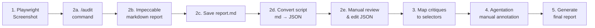

# Impeccable Integration Plan - FINAL ANALYSIS

**Created:** 2026-02-11
**Status:** Ready for Implementation
**Purpose:** Refactor annotate-critiques skill based on ACTUAL Impeccable behavior

---

## Critical Findings

### ✅ Actual Impeccable Implementation

**Source:**
- GitHub: https://github.com/open-horizon-labs/impeccable
- Skills Hub: https://skills.sh/open-horizon-labs/impeccable/critique

**Installation:**
```bash
npx skills add -y open-horizon-labs/impeccable
```

**18 Commands Available:**

| Command | Category | Purpose for TripOS |
|---------|----------|-------------------|
| **`/audit`** | Diagnostic | ✅ **Primary tool for Phase 4** - Accessibility, performance, responsiveness |
| **`/critique`** | Diagnostic | ✅ **Secondary tool** - UX feedback on hierarchy and clarity |
| `/normalize` | Quality | Design system alignment (28-token compliance) |
| `/polish` | Quality | Pre-release refinements |
| `/simplify` | Adaptation | Reduce unnecessary elements |
| `/clarify` | Adaptation | Copy and label improvements |
| `/optimize` | Quality | Load/rendering speed |
| `/harden` | Quality | Error handling, i18n, edge cases |
| `/animate` | Enhancement | Motion design for UX |
| `/colorize` | Enhancement | Add color to monochromatic designs |
| `/bolder` | Intensity | Increase design intensity |
| `/quieter` | Intensity | Tone down aggressive designs |
| `/delight` | Enhancement | Micro-interactions and joy |
| `/extract` | System | Component extraction |
| `/adapt` | Adaptation | Cross-device responsiveness |
| `/onboard` | System | First-time user experiences |
| `/teach-impeccable` | System | Initial project setup |

---

## ❌ CRITICAL MISMATCH: Our Assumptions vs Reality

### Our Current Assumption (WRONG)

**In [.claude/skills/annotate-critiques/SKILL.md](../../.claude/skills/annotate-critiques/SKILL.md:65-86):**

```markdown
**Option A: Use Impeccable.style (if installed)**

```bash
# In Claude Code chat:
/impeccable audit audit-output/run-[timestamp]/M15-Mobile.png

# Expected output (JSON):
{
  "screen": "M15-Blind-Budget",
  "critiques": [
    {
      "type": "token_violation",
      "severity": "P1",
      "description": "Budget input uses #16A34A instead of hsl(162 72% 37%)",
      "element": "budget cap input"
    }
  ]
}
```
```

### Actual Impeccable Behavior

**Real command:**
```bash
/audit   # No file path argument - conversational interaction
```

**Real output format:** Structured markdown report, NOT JSON

**Example Output Structure (from skills.sh documentation):**
```markdown
# Design Critique Report

## Anti-Patterns Verdict
[Pass/Fail assessment of AI-generation detection]

## Overall Impression
[Gut reaction and opportunities]

## What's Working
- Strength 1
- Strength 2
- Strength 3

## Priority Issues

### Issue 1: [Title]
- **What:** Description of problem
- **Why:** Impact on UX
- **Fix:** Concrete solution
- **Command:** /normalize (example)

### Issue 2: [Title]
[Same structure...]

## Minor Observations
[Less critical issues]

## Questions to Consider
[Open-ended design questions]
```

---

## Required Refactoring

### Phase 1: Update annotate-critiques Skill

**File:** `.claude/skills/annotate-critiques/SKILL.md`

**Changes Required:**

#### 1. Update Step 2: Generate Critiques

**OLD (Lines 60-127):**
```markdown
**Option A: Use Impeccable.style (if installed)**

```bash
# In Claude Code chat:
/impeccable audit audit-output/run-[timestamp]/M15-Mobile.png

# Expected output (JSON):
{
  "screen": "M15-Blind-Budget",
  "critiques": [...]
}
```

Save output to: `audit-output/run-[timestamp]/M15-critique.json`
```

**NEW:**
```markdown
**Option A: Use Impeccable /audit command (Conversational)**

1. Open screenshot in IDE or attach to conversation
2. Run in Claude Code chat:
   ```
   /audit
   ```
3. Impeccable will analyze the screenshot and provide structured markdown report
4. **Manually extract issues** from report into JSON format:
   - Copy "Priority Issues" section
   - Convert each issue to JSON critique object
   - Save to `audit-output/run-[timestamp]/M15-critique.json`

**Mapping from Impeccable report to JSON:**

```typescript
// Impeccable Priority Issue:
// ### Issue: Budget input uses hardcoded color
// - What: #16A34A used instead of design token
// - Why: Breaks theme switching, inconsistent with 28-token system
// - Fix: Replace with --privacy token hsl(162 72% 37%)
// - Command: /normalize

// Convert to JSON critique:
{
  "id": 1,
  "type": "token_violation",
  "severity": "P1",
  "category": "Design Tokens",
  "description": "Budget input uses hardcoded color #16A34A instead of --privacy token",
  "element": "budget cap input",
  "fix": "Replace border-green-600 with border-privacy in className",
  "file": null,
  "line": null
}
```

**Severity Mapping:**
- Impeccable "Priority Issues" → P0 or P1 (judge by impact)
- Impeccable "Minor Observations" → P2
- Impeccable "Anti-Patterns Verdict: FAIL" → P0
```

#### 2. Add Step 2.5: Semi-Automated Conversion Script

Create new script: `scripts/audit/convert-impeccable-report.ts`

**Purpose:** Parse Impeccable markdown → JSON critiques (semi-automated)

**Usage:**
```bash
# After running /audit, save markdown report to file
# Then convert to JSON:
npm run audit:convert audit-output/run-[timestamp]/M15-impeccable-report.md

# Output: audit-output/run-[timestamp]/M15-critique.json
```

**Implementation:**
- Parse markdown structure (## Priority Issues, ### Issue titles)
- Extract What/Why/Fix from each issue
- Map to JSON schema
- Assign severity based on keywords (accessibility → P0, token → P1, polish → P2)
- Require manual review/editing before pipeline continues

### Phase 2: Create Conversion Script

**File:** `scripts/audit/convert-impeccable-report.ts`

**Pseudocode:**
```typescript
async function parseImpeccableReport(markdownPath: string): Promise<CritiqueCollection> {
  const markdown = await readFile(markdownPath, 'utf-8');

  // Extract Priority Issues section
  const prioritySection = markdown.match(/## Priority Issues([\s\S]*?)##/)?.[1];

  // Parse individual issues
  const issueMatches = prioritySection.matchAll(/### Issue: ([^\n]+)\n- \*\*What:\*\* ([^\n]+)\n- \*\*Why:\*\* ([^\n]+)\n- \*\*Fix:\*\* ([^\n]+)/g);

  const critiques: Critique[] = [];

  for (const [, title, what, why, fix] of issueMatches) {
    critiques.push({
      id: critiques.length + 1,
      type: inferCritiqueType(what, title),
      severity: inferSeverity(why, title),
      category: inferCategory(title),
      description: what,
      element: inferElement(what), // Heuristic extraction
      fix,
      file: null,
      line: null,
    });
  }

  return {
    screen: inferScreenName(markdownPath),
    timestamp: new Date().toISOString(),
    viewports: { /* extract from markdown if present */ },
    critiques,
  };
}

function inferSeverity(why: string, title: string): CritiqueSeverity {
  // P0: Accessibility, security, critical UX
  if (/accessibility|wcag|screen reader|contrast/i.test(why) ||
      /critical|blocking|unusable/i.test(why)) {
    return 'P0';
  }

  // P1: Design tokens, consistency, performance
  if (/token|consistency|design system|performance/i.test(why) ||
      /confusion|unclear|misleading/i.test(why)) {
    return 'P1';
  }

  // P2: Polish, aesthetics, minor improvements
  return 'P2';
}

function inferCritiqueType(what: string, title: string): CritiqueCategory {
  if (/aria|screen reader|keyboard|contrast|accessibility/i.test(what)) return 'accessibility';
  if (/token|hardcoded.*color|#[0-9a-f]{6}/i.test(what)) return 'token_violation';
  if (/mobile|desktop|responsive|breakpoint/i.test(what)) return 'responsive';
  if (/padding|margin|spacing|whitespace/i.test(what)) return 'spacing';
  if (/font|typography|text-|heading/i.test(what)) return 'typography';
  if (/touch|hover|click|interaction|button/i.test(what)) return 'interaction';
  if (/hierarchy|focus|density/i.test(what)) return 'visual_hierarchy';
  if (/consistency|pattern|component/i.test(what)) return 'consistency';
  if (/budget|privacy|reveal/i.test(what)) return 'privacy';
  return 'token_violation'; // Default fallback
}

function inferElement(what: string): string {
  // Extract element description from "What" statement
  // Examples:
  // "Budget input uses #16A34A" → "budget input"
  // "Submit button missing hover state" → "submit button"

  const elementMatch = what.match(/^([^uses|missing|has|lacks]+)/i);
  return elementMatch ? elementMatch[1].trim().toLowerCase() : 'unknown element';
}
```

### Phase 3: Update Package.json Scripts

**File:** `package.json`

**Add new script:**
```json
{
  "scripts": {
    "audit:convert": "tsx scripts/audit/convert-impeccable-report.ts"
  }
}
```

### Phase 4: Update finish-feature Skill

**File:** `.claude/skills/finish-feature/SKILL.md`

**Update Phase 4 Part B: Visual Audit (lines 60-97):**

**OLD:**
```markdown
2. **Generate critiques (manual for MVP):**
   - User runs `/impeccable audit audit-output/run-[timestamp]/M##-*.png`
   - Save critique JSON manually
   - Or: Use external Impeccable.style tool
```

**NEW:**
```markdown
2. **Generate critiques with Impeccable:**

   a. Attach screenshot to conversation or open in IDE

   b. Run Impeccable audit:
      ```
      /audit
      ```

   c. Review Impeccable's structured markdown report

   d. Save report to file:
      ```
      audit-output/run-[timestamp]/M15-impeccable-report.md
      ```

   e. Convert to JSON (semi-automated):
      ```bash
      npm run audit:convert audit-output/run-[timestamp]/M15-impeccable-report.md
      ```

   f. **Manually review and edit** the generated JSON:
      - Verify severity assignments (P0/P1/P2)
      - Improve element descriptions for better selector matching
      - Add file paths if known
```

---

## Revised Workflow (Post-Impeccable)

### Complete Phase 4 Visual Audit Pipeline



**Steps:**
1. **Playwright Audit** (Automated)
   ```bash
   npm run audit:screen M15-Blind-Budget /trips/[id]/budget/blind
   ```
   Output: Screenshots + DOM JSON

2. **Impeccable Critique** (Semi-Manual)
   ```bash
   # In Claude Code:
   /audit
   # Attach: audit-output/run-[timestamp]/M15-Mobile.png
   # Save output to: audit-output/run-[timestamp]/M15-impeccable-report.md
   ```

3. **Convert Report** (Semi-Automated)
   ```bash
   npm run audit:convert audit-output/run-[timestamp]/M15-impeccable-report.md
   # Output: audit-output/run-[timestamp]/M15-critique.json
   # Manual: Review and edit JSON for accuracy
   ```

4. **Map Selectors** (Automated)
   ```bash
   npm run audit:map audit-output/run-[timestamp]/M15-critique.json audit-output/run-[timestamp]/M15-dom.json
   # Output: audit-output/run-[timestamp]/M15-mapped.json
   ```

5. **Agentation Annotation** (Manual)
   ```bash
   # Open localhost:3000/trips/[id]/budget/blind
   # In Claude Code: /agentation
   # Click selectors, paste critique text
   ```

6. **Generate Report** (Automated)
   ```bash
   npm run audit:report audit-output/run-[timestamp]/M15-mapped.json
   # Output: audit-output/run-[timestamp]/M15-critique-report.md
   ```

---

## Comparison: Three Critique Tools

### Use Case Matrix

| Tool | Phase | Purpose | Input | Output | Automation |
|------|-------|---------|-------|--------|------------|
| **Impeccable `/audit`** | Phase 4 | Design technical quality (a11y, tokens, responsive) | Screenshot (conversational) | Markdown report | Semi-manual |
| **Impeccable `/critique`** | Phase 4 | UX aesthetic review (hierarchy, clarity, polish) | Screenshot (conversational) | Markdown report | Semi-manual |
| **critical-review** | Phase 5 | Code/doc quality review (production-grade assessment) | Code/docs (in context) | 7-section report | Manual invocation |

### When to Use Each

**Phase 4: Visual Audit**
- ✅ Use `/audit` for technical issues (accessibility, design tokens, responsive design)
- ✅ Use `/critique` for UX polish (hierarchy, clarity, simplify/bolder suggestions)
- Run BOTH for comprehensive coverage:
  1. `/audit` → Technical P0/P1 issues
  2. `/critique` → UX P1/P2 polish items

**Phase 5: Quorum Validation**
- ✅ Use `/critical-review` for code quality review
- ✅ Use quorum scripts for automated checks
- Impeccable NOT used in Phase 5 (already done in Phase 4)

---

## Implementation Checklist

### Immediate (Do Now)

- [x] ✅ Document actual Impeccable behavior (this file)
- [ ] 🔧 Install Impeccable:
  ```bash
  npx skills add -y open-horizon-labs/impeccable
  ```
- [ ] 🔧 Test `/audit` command with sample screenshot
- [ ] 🔧 Test `/critique` command with same screenshot
- [ ] 📝 Save example output to `docs/architecture/impeccable-example-output.md`

### Week 0 (Before First Feature)

- [ ] 🔧 Create `scripts/audit/convert-impeccable-report.ts` (conversion script)
- [ ] 📝 Update `.claude/skills/annotate-critiques/SKILL.md` (refactor Step 2)
- [ ] 📝 Update `.claude/skills/finish-feature/SKILL.md` (update Phase 4 instructions)
- [ ] 🧪 Test complete pipeline end-to-end with dummy feature
- [ ] 📝 Document lessons learned

### Week 1+ (After Testing)

- [ ] 🔧 Improve conversion script based on actual usage patterns
- [ ] 🔧 Consider full automation (Impeccable API if available)
- [ ] 🔧 Integrate Agentation MCP server for programmatic annotations
- [ ] 📝 Update CLAUDE.md with finalized workflow

---

## Key Takeaways

1. **Impeccable is NOT a JSON API** - It's a conversational design critique tool
2. **Manual conversion step required** - Markdown report → JSON critiques
3. **Two commands for Phase 4** - Use both `/audit` (technical) and `/critique` (UX)
4. **Semi-automation acceptable for MVP** - Solo dev can handle manual steps in Weeks 0-6
5. **Critical-review is separate** - Use for code quality (Phase 5), not design (Phase 4)

---

## Sources

- [Impeccable GitHub Repository](https://github.com/open-horizon-labs/impeccable)
- [Impeccable Skills Hub - Critique Skill](https://skills.sh/open-horizon-labs/impeccable/critique)
- [Impeccable.style Official Website](https://impeccable.style)
- [Impeccable Command Cheatsheet](https://impeccable.style/cheatsheet)
