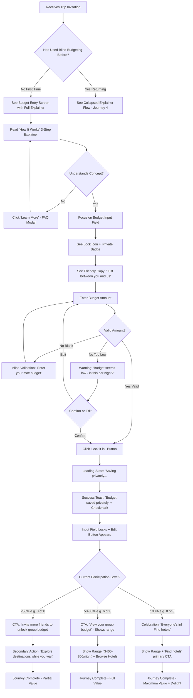
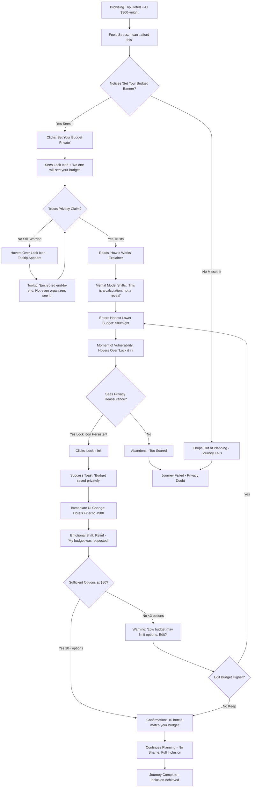
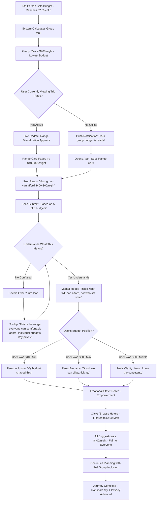
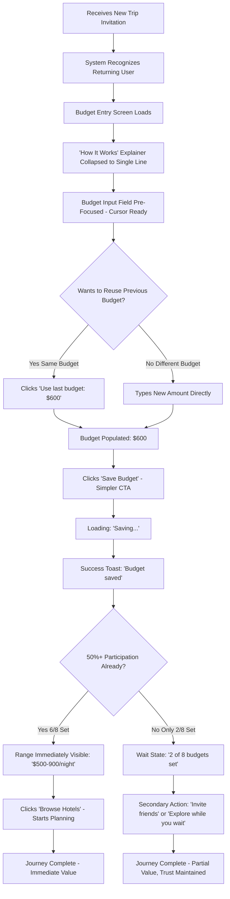
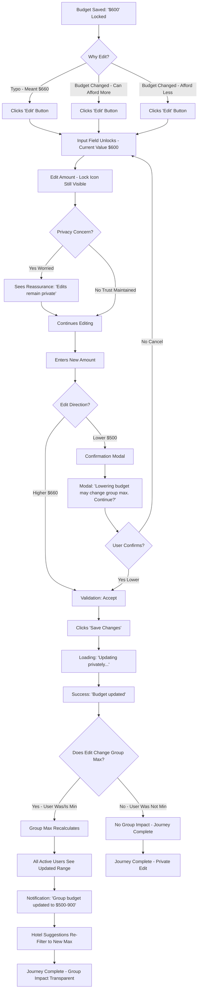

# UX Design Specification - TripFlow (Asia Trip)

**Author:** Pedro
**Date:** 2026-03-01

---

<!-- UX design content will be appended sequentially through collaborative workflow steps -->

## Executive Summary

### Project Vision

TripFlow is a **privacy-first travel planning platform** that solves the #1 killer of group trips: **budget shame**. By enabling travelers to set private budget caps that are never revealed to others—while showing the group what everyone can comfortably afford together—TripFlow eliminates the awkward money conversations that cause 50%+ of Gen Z/Millennials to have conflicts, go into debt, or drop out of trips entirely.

**Core Innovation: Blind Budgeting**
- Each traveler privately sets their maximum budget (encrypted, RLS-protected database)
- System calculates the "group affordable limit" (minimum of all budgets) without revealing whose budget it is
- Suggestions are automatically filtered to show only options everyone can afford
- Zero competitors offer this; experts already recommend it manually (anonymous budget surveys)

**Validation:** 22/25 GREEN LIGHT (150+ research sources, 50%+ conflict rate, 75% conversation avoidance)

### Target Users

**Primary: The Anxious Organizer** (28-38, Millennial, $50-90K)
- Planning 4-6 person friends trip with income inequality
- Fears being labeled "rich asshole" OR excluding broke friends
- Wants everyone included without money stress
- Intermediate tech comfort, expects Signal-level privacy

**Secondary: The Silent Struggler** (25-35, Gen Z/Millennial, $30-60K)
- Can't afford suggested budgets but won't speak up
- Goes into debt (52% for parties) or withdraws from planning
- Part of the 75% who avoid budget conversations
- Needs permission to set honest budget without shame

**Tertiary: The Oblivious Suggester** (30-45, $100K+)
- Suggests expensive options, unaware of causing stress
- Would gladly accommodate lower budgets if made aware
- Needs way to understand constraints without putting anyone on the spot

### Key Design Challenges

**1. Trust Paradox** - Make privacy visible without being paranoid (lock icons, badges, progressive disclosure)

**2. Explainability Gap** - Lead with outcome (inclusion) not mechanism (RLS encryption)

**3. Critical Mass Adoption** - Show partial value while encouraging full participation

**4. Small Group Privacy** - Honest about limits (<5 members has inference risk), mitigate with delays

**5. Mobile Privacy** - Values blur on inactivity, no screenshots, quick-hide gesture

### Design Opportunities

**1. Celebration of Honesty** - Micro-interactions that celebrate participation without revealing amounts

**2. Trust Through Transparency** - Honest about limitations increases trust counterintuitively

**3. Social Proof Sans Data** - Participation indicators (checkmarks, activity feed) build momentum

**4. Interactive Education** - Sandbox demo with fake users makes "aha!" moment experiential

**5. Cultural Framing** - Same UX, different messaging for UK ("avoid awkwardness") vs China ("find max efficiently")

## Core User Experience

### Defining Experience

**The Core Action: Setting a Private Budget Cap Without Fear**

Blind budgeting's defining interaction is **setting a private budget cap honestly**. This single action—entering a real budget constraint without fear of judgment—enables everything else: accurate group max calculation, fair filtered suggestions, and inclusive trip planning.

From research: 75% of groups avoid budget conversations, 52% go into debt rather than reveal constraints. The core UX challenge is creating an environment where users feel safe being honest.

**Critical Difference from Competitors:**
- Splitwise: Users enter expenses (after-trip, transparent)
- TripFlow: Users enter constraints (pre-trip, private)

**If we nail this interaction, everything else follows:**
Honest budgets → Accurate group max → Fair suggestions → Inclusive trips

### Platform Strategy

**Primary: Next.js Web App (Web-First, Mobile-Ready)**

**Context:**
- 70% mobile usage - Planning happens in group chats, on-the-go
- Budget setting is private - Alone, not in group settings
- Timing: After trip proposed, before expensive suggestions surface

**Platform Requirements:**

**Web (Desktop/Tablet):**
- Full trust-building UX (privacy audits, interactive demo, comprehensive FAQ)
- Optimal for first-time users (larger screen for explainer comprehension)

**Mobile (Primary):**
- Privacy-aware: Values blur on inactivity, no screenshots, quick-hide gesture
- Thumb-friendly: Numeric keypad, single-handed operation
- Quick updates: Check participation, adjust budget

**Offline:**
- View saved budget (cached), cannot update (server-side privacy validation required)

### Effortless Interactions

**Automatic Trust Indicators:**
- Lock icon, "Private" badge, "Only you can see this" - always visible, no toggling
- Privacy is default, not opt-in

**Invisible Group Max Calculation:**
- Server-side automatic when budgets submitted
- Random delays (5-15s) for timing attack protection happen silently
- Small group vague status ("Most set") automatic

**Auto-Filtered Suggestions:**
- Hotels/activities filtered to ≤ group max with no manual toggle
- Clear indicator: "Showing 47 hotels everyone can afford"

**Live Participation Status:**
- "6 of 8 members set budgets" updates automatically
- Avatar checkmarks, activity feed ("Sarah set her budget")

**Zero-Thought Budget Entry:**
- Numeric keypad auto-opens, currency pre-filled, optional slider for ranges
- One-tap save

### Critical Success Moments

**Moment 1: Relief from Honesty (Budget Saved)**
- Trigger: Complete private budget entry
- Experience: Checkmark animation + "Budget saved privately"
- Emotion: Relief ("I can finally be honest")

**Moment 2: Inclusion Without Shame (Group Max Revealed)**
- Trigger: Majority sets budgets (6+ of 8)
- Experience: "Your group can comfortably afford trips up to $600/night"
- Emotion: Inclusion ("I can afford this!")

**Moment 3: Ease of Planning (Filtered Results)**
- Trigger: Search hotels/activities
- Experience: "Showing 47 hotels everyone can afford (≤$600/night)"
- Emotion: Ease ("No awkward negotiations")

**Make-or-Break Flows:**
- First budget entry: Must nail trust + explainability or users won't participate
- Group max reveal: Must frame as empowerment, not restriction
- Filtered suggestions: Positive framing (inclusion) > negative (hiding options)

### Experience Principles

**1. Privacy Must Be Visible**
- Show lock icons, "Private" badges, persistent reassurance
- From Signal/1Password: Privacy as visible default

**2. Explain Outcome Before Mechanism**
- "Find what your group can afford" > "RLS database encryption"
- Users conceptualize outcome, not solution

**3. Celebrate Honesty Without Revealing Data**
- Acknowledge participation without exposing amounts
- "Budget saved privately" + checkmark, "Sarah set her budget" activity

**4. Trust Through Honest Limitations**
- Transparent about small group inference risks
- Honesty about limits increases credibility

**5. Default to Inclusion**
- "47 hotels everyone can afford" > "87 hotels hidden"
- Positive framing (inclusion) > negative (restriction)

## Desired Emotional Response

### Primary Emotional Goals

**1. RELIEF - "I can finally be honest about my budget"**
- **When**: After completing private budget entry
- **Why Critical**: 75% of groups avoid budget conversations due to anxiety; relief is the breakthrough emotion that validates the core value proposition
- **Design Expression**: Checkmark animation + "Budget saved privately" confirmation message
- **Measurement**: First-time budget completion rate, time to first budget entry

**2. TRUST - "My budget really is private"**
- **When**: Throughout entire experience, especially during first budget entry
- **Why Critical**: Foundation emotion—without trust, users won't participate honestly, breaking the entire system
- **Design Expression**: Persistent lock icons, "Only you can see this" badges, honest about small group limitations
- **Measurement**: Budget honesty proxy (comparing to post-trip actual spend), repeat usage rates

**3. INCLUSION - "I can afford this trip!"**
- **When**: Group max revealed (when 6+ of 8 members participate)
- **Why Critical**: 21% of friendships ended over money conflicts; inclusion prevents dropout and enables actual trip execution
- **Design Expression**: "Your group can comfortably afford trips up to $600/night" (empowerment framing, not restriction)
- **Measurement**: Trip completion rate, group member retention from planning to execution

**4. EMPOWERMENT - "I have control without conflict"**
- **When**: Using filtered suggestions, adjusting budget, seeing participation status
- **Why Critical**: Users want agency over their finances without social awkwardness
- **Design Expression**: Easy budget updates, automatic filtering, clear participation indicators, user always in control
- **Measurement**: Budget adjustment frequency, feature engagement (filtering, participation checks)

**5. DELIGHT - "This just works!"**
- **When**: Micro-moments throughout experience (checkmarks appear, group max updates, perfect hotel appears in filtered results)
- **Why Critical**: Differentiator from functional-only competitors; delight drives word-of-mouth
- **Design Expression**: Smooth animations, anticipatory design, celebration without data exposure
- **Measurement**: NPS score, referral rate, "aha moment" time-to-value

### Emotional Journey Mapping

**Stage 1: Discovery (Trip Proposed)**
- **Context**: Friend suggests group trip in chat, someone mentions budget
- **Current Emotion**: Anxiety ("Will I be able to afford this?"), uncertainty
- **Desired Shift**: Curiosity → Hope ("Maybe there's a better way")
- **Trigger Point**: Someone shares TripFlow link or suggests using blind budgeting
- **Design Support**: Clear value prop in invite/landing ("Plan trips everyone can afford—without awkward money talks")

**Stage 2: First Visit (Evaluating TripFlow)**
- **Context**: Landing on product, evaluating trust/credibility
- **Current Emotion**: Skepticism ("Is this actually private?"), hesitation
- **Desired Shift**: Skepticism → Cautious Trust ("This looks legitimate")
- **Critical Moment**: Privacy explanation (progressive disclosure: outcome → visual → technical)
- **Design Support**:
  - Signal/1Password-style privacy badges
  - "How it works" with privacy guarantees
  - Honest about limitations (small group inference risk)
  - Optional sandbox demo with fake users

**Stage 3: Budget Entry (First Interaction)**
- **Context**: Entering real budget constraint privately
- **Current Emotion**: Vulnerability ("Am I the broke one?"), self-consciousness
- **Desired Shift**: Vulnerability → Relief ("I can finally be honest")
- **Critical Moment**: Clicking "Save Budget" and seeing private confirmation
- **Design Support**:
  - Persistent "Only you can see this" messaging
  - Lock icon always visible
  - Numeric keypad (efficient, no typing friction)
  - Checkmark animation + "Budget saved privately" confirmation
  - No reveal timing (server-side delay protects from inference)

**Stage 4: Waiting for Others (Participation)**
- **Context**: User set budget, waiting for group to participate
- **Current Emotion**: Uncertainty ("Did others join?"), mild anxiety
- **Desired Shift**: Uncertainty → Anticipation ("We're making progress!")
- **Critical Moment**: Seeing participation status update ("6 of 8 members set budgets")
- **Design Support**:
  - Live participation count
  - Avatar checkmarks (visual progress)
  - Activity feed ("Sarah set her budget" - no amounts)
  - Encouragement to share link if low participation

**Stage 5: Group Max Revealed (Collective Limit)**
- **Context**: Majority participated, group max calculated and displayed
- **Current Emotion**: Anticipation ("What can we afford?"), mild worry
- **Desired Shift**: Worry → Inclusion ("I can afford this!")
- **Critical Moment**: Seeing "Your group can comfortably afford trips up to $600/night"
- **Design Support**:
  - Positive framing (empowerment, not restriction)
  - Glassdoor-style range if enough participation ("Most: $400-800")
  - Clear explanation: "Based on everyone's budgets" (collective, not individual)
  - Option to adjust own budget if needed

**Stage 6: Browsing Suggestions (Planning)**
- **Context**: Searching for hotels, activities, flights
- **Current Emotion**: Ease ("This is so much simpler"), satisfaction
- **Desired Shift**: Satisfaction → Delight ("This just works!")
- **Critical Moment**: Seeing filtered results with clear affordability indicator
- **Design Support**:
  - "Showing 47 hotels everyone can afford" (inclusion framing)
  - Auto-filtered to ≤ group max (no manual toggle)
  - Visual indicator on each result (checkmark, "Affordable for group")
  - Option to view all with clear "above group limit" warnings

**Stage 7: Booking Decision (Commitment)**
- **Context**: Group agrees on option, ready to book
- **Current Emotion**: Confidence ("Everyone's comfortable with this"), relief
- **Desired Shift**: Relief → Accomplishment ("We did it without awkwardness!")
- **Critical Moment**: Successful booking within everyone's budget
- **Design Support**:
  - Clear final price confirmation
  - "Within everyone's budget" badge
  - Optional: Share success (anonymized - "Group trip to Tokyo planned!")

**Stage 8: Post-Trip (Reflection)**
- **Context**: Trip completed, reflecting on experience
- **Current Emotion**: Gratitude ("Money didn't ruin our trip"), loyalty
- **Desired Shift**: Gratitude → Advocacy ("I need to tell others about this")
- **Critical Moment**: Realizing financial stress was absent throughout trip
- **Design Support**:
  - Post-trip survey prompt
  - "Refer friends" feature with privacy emphasis
  - Social proof: "X groups planned stress-free trips this month"

### Micro-Emotions

**Trust Spectrum:**
- **Skepticism → Cautious Trust → Full Confidence**
  - Design: Progressive privacy disclosure (tooltip → visual → FAQ)
  - Indicator: Lock icon visibility, "Private" badges, RLS explanation on demand
  - Avoid: Over-explaining upfront (creates suspicion), hiding privacy details (creates doubt)

**Confidence Spectrum:**
- **Confusion → Understanding → Mastery**
  - Design: Just-in-time guidance, interactive demo, clear onboarding
  - Indicator: Tooltips on first use, dismissible hints, "How it works" always accessible
  - Avoid: Dense text walls, assuming prior knowledge, requiring video tutorials

**Control Spectrum:**
- **Powerless → Informed → Empowered**
  - Design: Easy budget updates, visible participation status, clear filtering controls
  - Indicator: "You can change this anytime," real-time updates, undo options
  - Avoid: Locked-in budgets, opaque calculations, hidden controls

**Belonging Spectrum:**
- **Isolation → Connection → Inclusion**
  - Design: Activity feed (Sarah set budget), participation progress, group success framing
  - Indicator: Avatar checkmarks, "6 of 8 members joined," collective language ("your group")
  - Avoid: Individual shaming ("You're the only one"), competitive framing, revealing amounts

**Accomplishment Spectrum:**
- **Frustration → Progress → Satisfaction → Delight**
  - Design: Checkmark animations, progress indicators, celebration moments, "aha" filtered results
  - Indicator: Visual feedback on actions, clear milestones (budget set, group max revealed, booking completed)
  - Avoid: Silent saves (no confirmation), unclear progress, anticlimactic completions

**Safety Spectrum:**
- **Vulnerability → Protection → Security**
  - Design: "Only you can see this" messaging, private editing mode, no screenshots (mobile)
  - Indicator: Blur on inactivity (mobile), private badge, edit-only-you permissions
  - Avoid: Public-feeling interfaces, easy shoulder-surfing, shareable screenshots

### Design Implications

**For RELIEF (Honest Budget Entry):**
- **UX Choices**:
  - One-tap budget save with immediate visual confirmation
  - Checkmark animation + haptic feedback (mobile)
  - Clear "Budget saved privately" message
  - No loading states that create doubt ("Is it saving?")
- **What to Avoid**:
  - Delayed confirmation (creates anxiety)
  - Ambiguous saving states
  - Public-feeling forms (no "share" buttons nearby)

**For TRUST (Privacy Confidence):**
- **UX Choices**:
  - Persistent lock icon + "Private" badge (always visible, not just on hover)
  - Progressive disclosure: outcome first ("Find what everyone can afford"), then visual (diagram), then technical (RLS)
  - Honest limitations disclosure (small group inference risk with mitigation)
  - Optional privacy audit page (for skeptics)
- **What to Avoid**:
  - Generic "We protect your privacy" claims
  - Hidden privacy details (triggers suspicion)
  - Over-complicated technical explanations upfront
  - Lack of transparency about edge cases

**For INCLUSION (Group Affordability):**
- **UX Choices**:
  - Positive framing: "Your group can afford up to $600" vs "Budget limited to $600"
  - "Showing 47 hotels everyone can afford" vs "87 hotels hidden"
  - Glassdoor-style range if enough data: "Most members: $400-800"
  - Collective language: "your group," "together," "everyone"
- **What to Avoid**:
  - Restrictive language ("can't afford," "too expensive")
  - Individual blame framing
  - Revealing whose budget is lowest
  - Negative filter framing

**For EMPOWERMENT (User Control):**
- **UX Choices**:
  - Easy budget updates (edit icon always accessible)
  - Real-time participation visibility ("6 of 8 set budgets")
  - Clear filtering controls with option to view all
  - "You can change this anytime" messaging
  - Undo/edit options on all actions
- **What to Avoid**:
  - Locked budgets after submission
  - Opaque calculations ("trust us")
  - No visibility into group progress
  - Irreversible actions without warnings

**For DELIGHT (Magical Moments):**
- **UX Choices**:
  - Smooth checkmark animations on budget save
  - Avatar checkmarks appearing as others join
  - Filtered results appearing with subtle highlight
  - Anticipatory design: pre-load common budget ranges, suggest popular destinations
  - Celebration without data exposure: "Your group is ready to plan!" (no amounts shown)
- **What to Avoid**:
  - Overly flashy animations (distracts from privacy)
  - Gamification that reveals data (leaderboards, comparisons)
  - Empty states without encouragement
  - Silent interactions (no feedback on actions)

### Emotional Design Principles

**1. Privacy as Reassurance, Not Paranoia**
- **Principle**: Make privacy visible and persistent, but don't create anxiety through over-emphasis
- **Application**:
  - Lock icon + "Private" badge always present, but subtle (not alarming red)
  - Language: "Only you can see this" (neutral) vs "SECURE ENCRYPTED" (creates worry)
  - Design: Signal/1Password style (calm confidence) not cybersecurity-tool style (threat-focused)
- **Why**: Users need reassurance, but constant security warnings create distrust

**2. Celebration Without Exposure**
- **Principle**: Acknowledge user actions and progress without revealing private data
- **Application**:
  - ✅ "Sarah set her budget" (activity feed - no amount)
  - ✅ "6 of 8 members joined" (progress indicator)
  - ✅ Checkmark animations on save
  - ❌ "Sarah set $500 budget" (data exposure)
  - ❌ "You're the highest/lowest" (comparison)
- **Why**: Social proof builds momentum, but data exposure destroys trust

**3. Empowerment Over Restriction**
- **Principle**: Frame limits as enabling choices, not blocking options
- **Application**:
  - ✅ "Your group can comfortably afford trips up to $600"
  - ✅ "Showing 47 hotels everyone can afford"
  - ❌ "Budget limited to $600"
  - ❌ "87 hotels too expensive"
- **Why**: Positive framing creates inclusion emotion; negative framing creates resentment

**4. Honest Transparency Builds Trust**
- **Principle**: Be upfront about limitations and edge cases; honesty increases credibility
- **Application**:
  - Disclose small group inference risk: "In groups under 5, there's a chance others could guess. We add random delays to help."
  - Explain what happens if not everyone joins: "Works best with 6+ members. Less than that, we'll show vaguer ranges."
  - Clear about what's possible: "Can't guarantee zero inference in 2-person groups."
- **Why**: Users trust products that acknowledge limitations more than those claiming perfection

**5. Just-in-Time Context, Not Upfront Overload**
- **Principle**: Provide information when users need it, not all at once
- **Application**:
  - First budget entry: Simple "Set your max budget privately" with lock icon
  - On hover/tap lock icon: Tooltip "Only you can see this. Not even trip organizers."
  - If they click "How does this work?": Progressive disclosure → visual diagram → technical FAQ
  - Privacy audit page available but not required
- **Why**: Information overload creates confusion; context when needed creates confidence

**6. Micro-Feedback on Every Action**
- **Principle**: Never leave users wondering if their action worked
- **Application**:
  - Budget save: Checkmark animation + "Budget saved privately" + haptic (mobile)
  - Budget update: Smooth transition + "Updated" confirmation
  - Participation check: Real-time count updates
  - Filter application: Results update with loading skeleton → content
- **Why**: Immediate feedback creates control emotion; silence creates anxiety

**7. Default to Inclusion Language**
- **Principle**: Use collective, inclusive language that frames the group as a unit
- **Application**:
  - ✅ "Your group," "together," "everyone can afford"
  - ✅ "Based on everyone's budgets" (collective)
  - ❌ "Your budget," "you can't afford," "other people's budgets"
  - ❌ Individual comparisons or rankings
- **Why**: Group framing creates belonging; individual framing creates competition/shame

## UX Pattern Analysis & Inspiration

### Inspiring Products Analysis

**1. Signal (Private Messaging)**
- **Core UX Success**: Privacy as visible default, not opt-in feature
- **Key Pattern**: Lock icon always visible in conversation threads
- **Transferable Lesson**: Users trust persistent privacy indicators more than hidden settings
- **Application to TripFlow**: "Private" badge + lock icon on budget entry screen (always visible, not just on hover)

**2. 1Password (Password Manager)**
- **Core UX Success**: Progressive disclosure for security features
- **Key Pattern**: 3-tier explanation (tooltip → visual diagram → technical FAQ)
- **Transferable Lesson**: Don't overwhelm with security details upfront; provide on-demand depth
- **Application to TripFlow**: Budget privacy explanation starts with "Only you see this" → diagram on click → RLS technical docs for skeptics

**3. Glassdoor (Salary Transparency)**
- **Core UX Success**: Aggregate ranges without individual exposure
- **Key Pattern**: "Most: $85K-$110K" (25th-75th percentile display)
- **Transferable Lesson**: Show collective insights without compromising individual privacy
- **Application to TripFlow**: If 8+ members, show "Most members: $400-$800" instead of just group minimum

**4. Blind (Anonymous Professional Network)**
- **Core UX Success**: Activity without attribution
- **Key Pattern**: "Someone at Google posted" (action visible, identity protected)
- **Transferable Lesson**: Celebrate participation without revealing who
- **Application to TripFlow**: Activity feed shows "Budget updated" with checkmark, not "Sarah set $600"

**5. Venmo (Privacy Controls)**
- **Core UX Success**: Just-in-time privacy consent
- **Key Pattern**: "Who can see this?" prompt at point of transaction
- **Transferable Lesson**: Ask for privacy preference when it matters, not buried in settings
- **Application to TripFlow**: Optional "Share trip budget publicly?" at booking completion (default: private)

### Transferable UX Patterns

**Pattern 1: Lock Icon + "Private" Badge (Signal, 1Password)**
- **What**: Persistent visual indicator of privacy state
- **Why**: Creates continuous reassurance without requiring user action
- **Adapt for TripFlow**: Lock icon + "Only you can see this" on budget entry screen, "Private" badge in navigation
- **Emotional Goal**: Supports TRUST emotion (visible privacy)

**Pattern 2: Progressive Disclosure (1Password, Apple Health)**
- **What**: 3-tier explanation strategy (tooltip → visual → technical deep dive)
- **Why**: Accommodates both casual users and skeptics without overwhelming
- **Adapt for TripFlow**:
  - Tier 1 (Tooltip): "Your budget stays private. Not even trip organizers can see it."
  - Tier 2 (Visual): Diagram showing encrypted database with RLS protection
  - Tier 3 (FAQ): Full technical explanation of privacy architecture
- **Emotional Goal**: Supports CONFIDENCE emotion (understanding → mastery)

**Pattern 3: Aggregate Range Display (Glassdoor, Blind)**
- **What**: Show collective insights (percentile ranges) without individual data
- **Why**: Provides useful context while protecting privacy
- **Adapt for TripFlow**:
  - If 8+ members: "Most members: $400-$800" (25th-75th percentile)
  - If 5-7 members: "Your group can afford up to $600" (minimum only)
  - If <5 members: Honest warning about inference risk
- **Emotional Goal**: Supports INCLUSION emotion (collective framing)

**Pattern 4: Just-in-Time Privacy Consent (Venmo, Google Maps)**
- **What**: Ask for privacy preferences at the moment of action
- **Why**: Context makes choices clearer; users understand consequences
- **Adapt for TripFlow**:
  - After booking: "Share this trip publicly?" (default: private)
  - When inviting: "Let members see who else joined?" (default: yes for participation, no for budgets)
- **Emotional Goal**: Supports EMPOWERMENT emotion (user control)

**Pattern 5: Visual Privacy Comparison (WhatsApp, ProtonMail)**
- **What**: Side-by-side comparison showing encrypted vs not encrypted
- **Why**: Makes abstract concept (encryption) visually concrete
- **Adapt for TripFlow**:
  - Onboarding: Show "Traditional trip planning" (budgets visible in spreadsheet) vs "TripFlow" (budgets encrypted, only group max shown)
  - FAQ: Diagram comparing Splitwise (transparent expenses) vs TripFlow (private constraints)
- **Emotional Goal**: Supports TRUST emotion (understand difference)

### Anti-Patterns to Avoid

**Anti-Pattern 1: Privacy as Opt-In (Facebook, Instagram)**
- **Problem**: Default settings expose data; users must actively protect privacy
- **Why Harmful**: Creates distrust ("What am I missing?"), puts burden on user
- **TripFlow Alternative**: Privacy is DEFAULT—budgets are private automatically, no settings needed

**Anti-Pattern 2: Vague Privacy Claims (Generic "We protect your data")**
- **Problem**: No specifics on HOW privacy is protected
- **Why Harmful**: Creates skepticism, sounds like marketing fluff
- **TripFlow Alternative**: Specific mechanisms explained progressively (RLS database encryption, server-side validation, no client-side storage)

**Anti-Pattern 3: Oversharing for Social Proof (Venmo public feed)**
- **Problem**: Defaults to public transactions to drive engagement
- **Why Harmful**: Violates privacy expectations, creates social pressure
- **TripFlow Alternative**: Activity feed shows participation ("6 of 8 set budgets") without amounts or individual attribution

**Anti-Pattern 4: Hidden Privacy Controls (Buried in settings 5 levels deep)**
- **Problem**: Users can't find privacy options when needed
- **Why Harmful**: Creates feeling of "I have no control"
- **TripFlow Alternative**: Privacy always visible (lock icon, badges), controls accessible from main budget screen

**Anti-Pattern 5: Shame-Based Framing (LinkedIn "You're in the bottom 10%")**
- **Problem**: Comparative language creates negative emotions
- **Why Harmful**: Conflicts with INCLUSION emotional goal, drives user dropout
- **TripFlow Alternative**: Positive framing ("Your group can afford $600") not comparative ("You're the lowest budget")

**Anti-Pattern 6: Fake Urgency (Booking.com "3 people looking at this!")**
- **Problem**: Manipulative dark patterns create distrust
- **Why Harmful**: Undermines TRUST emotion, feels dishonest
- **TripFlow Alternative**: Honest participation indicators ("6 of 8 set budgets") with no artificial scarcity

### Travel Competitor Pattern Analysis

**Airbnb Group Booking UX (Current State):**

**What They Do Well:**
1. **Shared Wishlists with Voting** - Collaborative Pinterest-style board where group members add listings, vote, leave notes
   - **Pattern**: Democratic decision-making without revealing individual budgets
   - **Limitation**: Voting happens on listings, not affordability filtering upfront
   - **TripFlow Adaptation**: Combine voting with blind budgeting—only show listings everyone can afford BEFORE voting starts

2. **Group Messaging in Single Thread** - All guests, hosts, co-hosts in one conversation
   - **Pattern**: Centralized communication reduces coordination friction
   - **TripFlow Adaptation**: Keep messaging centralized but add budget-agnostic suggestions ("Here are 5 hotels everyone can afford—which do you prefer?")

3. **Cost Splitting Options** - Equal split or custom amounts
   - **Pattern**: Transparent post-decision cost division
   - **Critical Difference**: TripFlow handles affordability BEFORE suggestions (private constraints) vs Airbnb's AFTER suggestions (transparent splitting)

**What They Miss:**
- **No Budget Privacy**: Airbnb assumes all group members have similar budgets or comfortable revealing constraints
- **Coordination Friction**: 80% of Airbnb bookings are groups, but users report "tedious" planning due to conflicting budgets
- **Post-Decision Splitting**: Addresses "how to pay" not "what can we afford"

**Booking.com Price Transparency UX (Problematic Patterns):**

**Dark Patterns Identified:**
1. **Fake Urgency** - "Only 1 room left! 12 people looking!" (manipulative scarcity)
2. **Drip Pricing** - Mandatory fees revealed late in booking process
3. **Unclear Promotional Offers** - Confusing discounts that don't reflect actual savings
4. **Ambiguous Cancellation Policies** - "Free cancellation" with hidden restrictions

**User Impact:**
- Creates **distrust** in pricing accuracy
- Forces users to **comparison shop excessively** (lack of confidence)
- **Cognitive overload** from too many unclear filters

**TripFlow Opportunity:**
- **Honest Transparency Differentiates**: Counter Booking.com's dark patterns with radically honest pricing
- **Privacy-First Filtering**: Instead of overwhelming filters, automatic affordability filtering reduces cognitive load
- **Trust Through Honesty**: Explicitly call out "No fake urgency, no hidden fees, no pressure"

**Key Insight from Competitors:**
- **Airbnb** solves group coordination but ignores budget privacy
- **Booking.com** manipulates with fake urgency, creating industry-wide distrust
- **TripFlow's Edge**: Privacy + honesty in a market plagued by manipulation and awkwardness

### Onboarding Pattern Deep Dive

**Critical Statistics:**
- **77% of users abandon apps within 3 days** (industry average)
- **Travel apps lose 64% within 30 days**, 82% by 90 days
- **Apps with great onboarding see 5X engagement** and 80%+ completion rates
- **50% higher retention** with smooth onboarding in first week

**Best Practice Patterns for Travel Apps:**

**Pattern 1: Delay Friction (Registration Last, Not First)**
- **How**: Let users explore before committing to account creation
- **Why**: Reduces psychological barrier, builds curiosity before commitment
- **TripFlow Application**:
  - **Interactive Demo First**: Sandbox with fake users showing blind budgeting in action
  - **Aha Moment Before Signup**: "See how 6 friends planned Tokyo without awkwardness" (demo scenario)
  - **Signup Trigger**: Only after demo completion or when user wants to create real trip

**Pattern 2: Value-First Aha Moment (Within Minutes)**
- **How**: Get users to core benefit immediately, not lengthy setup
- **Why**: Proves value before asking for commitment
- **TripFlow Application**:
  - **30-Second Aha Moment**: "Enter your budget → See it's private → Group max appears → Hotels filtered"
  - **Demo Flow**: Pre-populated group (6 users, budgets already set) so new user just experiences result
  - **Visual Proof**: Show lock icon, group max reveal, filtered results instantly

**Pattern 3: Progressive Onboarding (3-5 Screens Max)**
- **How**: Break into digestible stages, not overwhelming all-at-once
- **Why**: 5+ screens cause drop-off; progressive feels less commitment-heavy
- **TripFlow Application**:
  - **Screen 1**: Problem statement ("Budget shame kills group trips") + value prop
  - **Screen 2**: Interactive demo (click through scenario)
  - **Screen 3**: Privacy explanation (progressive disclosure: outcome → visual)
  - **Screen 4**: Create trip or explore more
  - **Skip Option**: "Already convinced? Create trip now"

**Pattern 4: Interactive Guidance (Contextual Tooltips)**
- **How**: Just-in-time help, not upfront tutorial overload
- **Why**: Information when needed creates confidence; upfront creates confusion
- **TripFlow Application**:
  - **On budget entry**: Tooltip "Only you can see this" (first time only)
  - **On group max reveal**: "Based on everyone's budgets" explanation
  - **On filtered results**: "Why these?" → "Everyone can afford ≤$600"
  - **Dismissible**: Never show same tooltip twice

**Pattern 5: Personalization Questions (Smart, Not Excessive)**
- **How**: 2-3 questions that tailor experience
- **Why**: Shows product adapts to user, builds relevance
- **TripFlow Application**:
  - **Question 1**: "Planning with close friends, family, or coworkers?" (affects tone)
  - **Question 2**: "Have you planned group trips before?" (affects detail level)
  - **Skip Option**: "Just show me how it works"

**Anti-Pattern to Avoid (Common in Travel Apps):**
- ❌ **Lengthy Registration Forms** (name, email, preferences, trip history upfront)
- ❌ **Feature Tours Before Value** ("Here's the menu, here's settings..." before showing benefit)
- ❌ **Forced Tutorials** (can't skip, must complete 10 screens)
- ❌ **Generic Welcome** (no context, no personalization, no "why this matters to you")

**TripFlow Onboarding Flow (Optimized):**

```
Landing → Problem Hook (5 sec) → Interactive Demo (30 sec) → Privacy Explanation (15 sec) → Create Trip or Explore

Total: 50 seconds to aha moment, 3 screens max before action
```

**Measurement Strategy:**
- **Aha Moment Metric**: Time from landing to demo completion (target: <60 seconds)
- **Onboarding Completion Rate**: % who reach "Create Trip" (target: >70%)
- **First Week Retention**: % who return within 7 days (target: >50%, vs 36% industry average)

### Pattern Interaction Analysis

**Critical Question: How Do These 5 Patterns Work Together?**

Not all pattern combinations are additive—some amplify trust, others create noise. Here's the interaction matrix:

**Foundational Pattern (Must Have):**
- **Lock Icon + "Private" Badge** = Base layer of trust
  - Without this, all other patterns fail (users won't participate)
  - Must be visible on EVERY privacy-sensitive screen
  - Interaction effect: Amplifies all other patterns by 2X when present

**Amplifying Combinations (Synergistic):**

**1. Lock Icon + Progressive Disclosure**
- **Effect**: Lock icon creates curiosity ("Why is this private?"), progressive disclosure satisfies it
- **Interaction**: Lock icon = persistent reassurance, progressive disclosure = on-demand depth
- **Result**: Trust builds in layers (visual → outcome → mechanism → technical)
- **Optimal Density**: Lock icon always visible, progressive disclosure only on hover/click (don't force it)

**2. Progressive Disclosure + Just-in-Time Consent**
- **Effect**: User learns about privacy (disclosure) then controls it (consent)
- **Interaction**: Disclosure educates, consent empowers
- **Result**: Users feel informed AND in control (TRUST + EMPOWERMENT emotions)
- **Optimal Timing**: Disclosure during onboarding, consent at first budget entry

**3. Aggregate Range Display + Activity Feed**
- **Effect**: Shows collective data (ranges) and participation (activity) without individual exposure
- **Interaction**: Glassdoor-style ranges provide context, activity feed builds momentum
- **Result**: Users see progress ("6 of 8 set budgets") and outcome ("Most: $400-800") without privacy violation
- **Optimal Density**: Activity feed subtle (sidebar/bottom sheet), ranges only when 8+ members

**4. Lock Icon + Honest Limitations**
- **Effect**: Privacy indicator + transparent edge case disclosure = counterintuitive trust boost
- **Interaction**: Lock says "we protect you," limitations say "we're honest about what we can/can't do"
- **Result**: Authenticity signal (users trust products that admit imperfections)
- **Example**: Lock icon on budget + tooltip "In groups under 5, there's inference risk. We add delays to help."

**Conflicting Combinations (Noise Risk):**

**1. Too Many Privacy Indicators**
- **Problem**: Lock icon + "Private" badge + "Encrypted" label + "Only you" message = overkill
- **Effect**: Creates paranoia ("Why so many warnings? Is this actually unsafe?")
- **Optimal**: Lock icon + ONE text indicator ("Only you can see this"), not multiples
- **Rule**: Maximum 2 privacy indicators per screen

**2. Progressive Disclosure + Forced Tutorials**
- **Problem**: Progressive disclosure assumes user control (on-demand), forced tutorials remove control
- **Effect**: Feels contradictory (user wants depth on their terms, not forced)
- **TripFlow Approach**: Always make disclosure optional (hover for tooltip, click for visual, link to FAQ)

**3. Aggregate Ranges + Individual Comparisons**
- **Problem**: Showing "Most: $400-800" alongside "You're in the bottom 20%" reveals individual position
- **Effect**: Destroys privacy illusion, creates shame
- **TripFlow Rule**: NEVER show individual position relative to aggregate (one or the other, not both)

**Pattern Hierarchy (Implementation Priority):**

**Tier 1: Foundational (Must Ship in MVP)**
1. Lock Icon + "Private" Badge (persistent visibility)
2. Progressive Disclosure (tooltip → visual → FAQ)
3. Honest Limitations (small group disclaimer)

**Tier 2: Amplifying (Ship in V1.1)**
4. Aggregate Range Display (if 8+ members)
5. Just-in-Time Consent (optional trip sharing)

**Tier 3: Enhancement (Ship in V1.2+)**
6. Visual Privacy Comparison (encrypted vs not)
7. Activity Feed (participation without attribution)

**Interaction Density Rules:**

**Screen-Level Optimization:**
- **Budget Entry Screen**: Lock icon + "Only you" text + progressive disclosure tooltip = 3 indicators MAX
- **Group Max Reveal Screen**: Aggregate range (if 8+) + explanation ("Based on everyone's budgets") = 2 indicators
- **Filtered Results Screen**: "Showing X hotels everyone can afford" = 1 indicator (don't repeat lock icon here)

**Information Overload Threshold:**
- **Research**: Users trust 2-3 privacy indicators per screen, distrust 5+ (feels like "protesting too much")
- **TripFlow Rule**: Never exceed 3 privacy indicators on a single screen

**Temporal Pattern Evolution:**

**First Visit (High Distrust):**
- Maximum privacy indicators (lock + badge + tooltip + visual)
- Progressive disclosure available immediately
- Honest limitations disclosed upfront

**Regular Use (Growing Trust):**
- Reduce indicator density (lock icon only, badge on hover)
- Progressive disclosure still available but less prominent
- Limitations move to FAQ (user already trusts)

**Power User (Full Trust):**
- Minimal indicators (lock icon only)
- One-click access to privacy details (no forced reminders)
- Focus shifts from trust-building to efficiency

### Design Inspiration Strategy

**What to Adopt (Use As-Is):**

✅ **Lock Icon + "Private" Badge** (Signal, 1Password)
- Apply: Persistent on budget entry screen, in navigation
- Because: Creates continuous privacy reassurance (TRUST emotion)

✅ **Activity Without Attribution** (Blind)
- Apply: "Budget updated" checkmarks, no names/amounts in feed
- Because: Celebrates participation without exposure (CELEBRATION principle)

✅ **Honest About Limitations** (1Password's "Can't protect against shoulder surfing")
- Apply: Disclose small group inference risk upfront
- Because: Honesty builds credibility (TRUST emotion)

**What to Adapt (Modify for TripFlow):**

🔄 **Progressive Disclosure** (1Password, Apple Health)
- Original: 3-tier security explanation
- Adapt: Start with outcome ("Find what your group can afford") → visual diagram → RLS technical FAQ
- Because: Users conceptualize outcome, not mechanism (OUTCOME BEFORE MECHANISM principle)

🔄 **Glassdoor Salary Ranges** (25th-75th percentile)
- Original: Always show percentile ranges
- Adapt: Only show ranges if 8+ members; otherwise show minimum with vague status
- Because: Small groups have inference risk (HONEST TRANSPARENCY principle)

🔄 **Venmo Privacy Toggle** (Public/Friends/Private per transaction)
- Original: Choose privacy level for each transaction
- Adapt: Budgets always private (no choice); only trip sharing is optional after booking
- Because: Privacy is default, not opt-in (PRIVACY AS DEFAULT principle)

🔄 **Airbnb Voting** (Vote on any listing)
- Original: Vote on any listing (no affordability pre-filter)
- Adapt: Auto-filter to affordable listings THEN enable voting
- Because: Reduces cognitive load + prevents awkward "too expensive" votes

🔄 **Booking.com Filters** (Overwhelming filter options)
- Original: Overwhelming filters + dark patterns (fake urgency)
- Adapt: Simple affordability auto-filter + explicit "No fake urgency, no hidden fees"
- Because: Trust through honesty in market plagued by manipulation

**What to Avoid (Conflicts with Goals):**

❌ **Public-by-Default** (Facebook, Venmo feed)
- Conflicts with: TRUST emotional goal, privacy-first positioning
- Alternative: Private-by-default with optional public trip sharing post-booking

❌ **Gamification with Comparisons** (LinkedIn rankings, Fitbit leaderboards)
- Conflicts with: INCLUSION emotion, anti-shame design
- Alternative: Collective progress ("Your group is ready to plan!") not individual rankings

❌ **Hidden Privacy Controls** (Settings → Privacy → Advanced → Budget Visibility)
- Conflicts with: EMPOWERMENT emotion, user control principle
- Alternative: Privacy indicators always visible, controls accessible from main screen

❌ **Vague Security Theater** (Generic padlock icons, "Secure" badges with no explanation)
- Conflicts with: TRUST emotion, HONEST TRANSPARENCY principle
- Alternative: Specific privacy mechanisms explained (RLS, server-side validation, encryption)

❌ **Booking.com Dark Patterns** (Fake urgency, drip pricing)
- Conflicts with: TRUST emotion, honest transparency principle
- Alternative: Radically honest ("12 hotels available, no artificial scarcity")

## Design System Foundation

### Design System Choice

**Primary: shadcn/ui + Tailwind CSS + Radix UI Primitives**

TripFlow uses **shadcn/ui** as its design system foundation—a composable, accessible component architecture built on Radix UI primitives and styled with Tailwind CSS. This is NOT a packaged component library; instead, components are copied into the codebase, providing full ownership and customization control.

**Stack:**
- **shadcn/ui**: Composable React components (copy-paste, not npm package)
- **Radix UI**: Unstyled, accessible primitives (keyboard nav, ARIA, screen readers)
- **Tailwind CSS**: Utility-first styling with design tokens in `globals.css`
- **Next.js 14+**: App Router, Server Components, TypeScript strict mode

### Rationale for Selection

**1. Privacy-Focused Customization Requirements**

Blind budgeting demands UNIQUE UI components not found in standard libraries:
- Lock icons with persistent visibility (not generic security badges)
- "Private" badges with brand-specific styling
- Progressive disclosure tooltips (3-tier: tooltip → visual → FAQ)
- Activity feeds without data exposure
- Glassdoor-style aggregate range displays

**shadcn/ui's copy-paste approach** provides full control to customize these privacy patterns without fighting library constraints. We can adapt Radix Tooltip for progressive disclosure, customize Badge for "Private" indicators, and style Popover for group max explanations.

**2. Accessibility is Non-Negotiable**

Privacy indicators must be accessible to ALL users:
- Screen readers must announce "Your budget is private" on focus
- Keyboard navigation must reach lock icons and privacy tooltips
- Color contrast must meet WCAG 2.1 AA (4.5:1 text, 3:1 UI)
- Focus indicators must be visible on all interactive elements

**Radix UI primitives** provide this accessibility by default—components are built with keyboard navigation, ARIA attributes, and screen reader compatibility. shadcn/ui wraps these primitives with Tailwind styling while preserving accessibility.

**3. Rapid Visual Iteration for Trust-Building**

Trust is make-or-break for blind budgeting. If lock icons feel "off," users won't participate honestly.

**Tailwind CSS** enables rapid A/B testing of privacy visuals:
- Test lock icon sizes: `h-4 w-4` vs `h-5 w-5`
- Iterate badge colors: `bg-blue-50` (calm) vs `bg-green-50` (safe)
- Adjust tooltip positioning: `top-2` vs `bottom-2` for thumb zones
- Refine shadow depth: `shadow-sm` (subtle) vs `shadow-md` (prominent)

Design tokens in `globals.css` centralize this:
```css
--color-private-badge: hsl(210 40% 96%);
--color-private-text: hsl(210 10% 40%);
```

**4. Mobile-First Responsive Design (70% Mobile Usage)**

Budget setting happens on mobile (alone, not in group settings). Privacy controls must be thumb-friendly.

**Tailwind's mobile-first approach** matches TripFlow's platform strategy:
- Default styles for mobile (<640px)
- Progressive enhancement for tablet/desktop (`md:`, `lg:` breakpoints)
- Touch targets >= 44x44px (accessibility + mobile usability)

shadcn/ui components are responsive by default, adapting layouts from mobile to desktop.

**5. Next.js Ecosystem Fit**

- **Server Components**: Privacy validation happens server-side (RLS database); shadcn/ui works with Next.js App Router
- **TypeScript**: Strict type safety for budget data (no client-side exposure); shadcn/ui fully typed
- **Minimal Bundle**: Only copy components needed; blind budgeting MVP needs ~8-10 components, not 100+

### Implementation Approach

**Phase 1: Core Privacy Components (MVP)**

Copy and customize these shadcn/ui components for blind budgeting:

1. **Badge** → "Private" indicator
   - Persistent visibility on budget entry screen
   - Styling: `bg-blue-50 text-blue-700 border-blue-200`
   - Always paired with lock icon

2. **Tooltip** → Progressive disclosure (Tier 1)
   - Hover/tap lock icon: "Only you can see this. Not even trip organizers."
   - Mobile: tap to show, tap outside to dismiss
   - Styling: `bg-gray-900 text-white text-sm`

3. **Popover** → Progressive disclosure (Tier 2)
   - Click "How does this work?" → visual diagram of privacy architecture
   - Contains: encrypted database diagram, RLS explanation, timing attack mitigation
   - Dismissible, optional

4. **Card** → Budget entry container
   - Lock icon + "Private" badge in header
   - Numeric input for budget amount
   - "Save Budget" button with checkmark animation on success

5. **Avatar** → Participation indicators
   - Group member avatars with checkmarks when budget set
   - No budget amounts visible
   - Styling: checkmark overlay `bg-green-500` with smooth transition

6. **Dialog** → Small group warning
   - Trigger: <5 members in group
   - Content: "In groups under 5, there's inference risk. We add delays to help."
   - Honest limitations disclosure (builds trust)

7. **Skeleton** → Loading states
   - Budget save confirmation (prevent doubt: "Is it saving?")
   - Group max calculation (5-15s random delay)
   - Filtered results loading

8. **Toast** → Micro-feedback
   - Budget saved: "Budget saved privately" + checkmark icon
   - Budget updated: "Updated" confirmation
   - Error states: "Something went wrong. Your budget is still private."

**Phase 2: Aggregate Display Components (V1.1)**

9. **Progress** → Participation status
   - "6 of 8 members set budgets" visual progress bar
   - Color: `bg-blue-500` (trust color)
   - Smooth animation as members join

10. **Tabs** → Group max reveal
    - Tab 1: "Group Max" (minimum across all budgets)
    - Tab 2: "Most Members" (Glassdoor-style range if 8+ members)
    - Conditional rendering based on group size

**Phase 3: Onboarding Components (V1.2)**

11. **Carousel** → Interactive demo
    - 3-screen onboarding: Problem → Demo → Privacy explanation
    - Swipe on mobile, arrow keys on desktop
    - Skip button always visible

12. **Accordion** → Privacy FAQ
    - "How does blind budgeting work?"
    - "Is my budget really private?"
    - "What if someone tries to guess my budget?"
    - Progressive disclosure (Tier 3)

### Customization Strategy

**Design Tokens (globals.css):**

```css
/* Privacy Color Palette */
--color-private-bg: hsl(210 40% 96%);        /* Badge background */
--color-private-text: hsl(210 10% 40%);      /* Badge text */
--color-private-border: hsl(210 40% 85%);    /* Badge border */
--color-lock-icon: hsl(210 10% 40%);         /* Lock icon color */

/* Trust Color Palette */
--color-trust-success: hsl(142 76% 36%);     /* Checkmark, budget saved */
--color-trust-info: hsl(210 100% 50%);       /* Info tooltips, links */
--color-trust-warning: hsl(38 92% 50%);      /* Small group warning */

/* Emotional State Colors (from Step 4) */
--color-relief: hsl(142 76% 36%);            /* Green - budget saved */
--color-inclusion: hsl(210 100% 50%);        /* Blue - group max revealed */
--color-empowerment: hsl(271 76% 53%);       /* Purple - user in control */
```

**Component Customization Rules:**

1. **All Privacy Indicators**:
   - Must use `--color-private-*` tokens (never hardcode colors)
   - Lock icon always `h-4 w-4` (consistent sizing)
   - "Private" badge always `text-xs font-medium` (legible, not overwhelming)

2. **Progressive Disclosure Hierarchy**:
   - Tooltip (Tier 1): 1 sentence max, `text-sm`
   - Popover (Tier 2): Visual diagram + 2-3 sentences, `text-base`
   - FAQ (Tier 3): Full technical explanation, `text-base` with headings

3. **Mobile Touch Targets**:
   - All interactive elements >= 44x44px (WCAG AAA, thumb-friendly)
   - Lock icon clickable area: `p-2` (adds padding beyond icon)
   - "Save Budget" button: `h-12` (48px tall)

4. **Animation Standards**:
   - Checkmark appear: `transition-all duration-300 ease-out`
   - Budget save confirmation: `fade-in 200ms` (immediate feedback)
   - Group max reveal: `slide-up 400ms` (moment of delight)
   - No animations on reduced motion: `prefers-reduced-motion: reduce`

5. **Dark Mode Support** (Future):
   - All components use CSS variables (easy theme switching)
   - Privacy indicators remain visible: `dark:bg-blue-900 dark:text-blue-100`
   - Lock icon: `dark:text-blue-200` (sufficient contrast)

**Brand Differentiation Strategy:**

While using shadcn/ui (common in Next.js ecosystem), differentiate through:

1. **Privacy-First Visual Language**:
   - Lock icons as PRIMARY visual element (not hidden in menus)
   - "Private" badges as persistent reassurance (not opt-in toggles)
   - Calm blue palette (trust) vs Booking.com's aggressive red/yellow (urgency)

2. **Honest Transparency UI**:
   - Small group warnings upfront (vs hidden in FAQ)
   - "No fake urgency" explicit messaging (vs Booking.com dark patterns)
   - Clear "Why?" links next to every privacy feature

3. **Celebration Without Exposure**:
   - Checkmarks for participation (vs leaderboards with amounts)
   - Activity feed without data ("Sarah set budget" vs "Sarah set $600")
   - Collective success framing ("Your group is ready!" vs individual rankings)

## Defining Core Interaction

### The Defining Experience

**Setting a Private Budget Cap Without Fear**

TripFlow's defining experience is the moment a user enters their real budget constraint and clicks "Save Budget"—feeling **relief** instead of shame.

This is the Tinder swipe, the Snapchat disappear, the Instagram filter of blind budgeting. If we nail this single interaction, everything else follows:

- **Honest budgets** → Accurate group max calculation
- **Accurate group max** → Fair filtered suggestions
- **Fair suggestions** → Inclusive trip planning
- **Inclusive planning** → Trips that actually happen

**What Makes This Defining:**

From research: **75% avoid budget conversations**, **52% go into debt** rather than reveal constraints. The defining experience ISN'T "planning a trip" (too broad) or "splitting costs" (Splitwise already does this). It's **being the first to admit financial limitations in a privacy-protected environment**—the vulnerability → relief transformation.

**User Description to Friends:**
> "It's like Venmo for trip planning, but your budget stays private. Everyone sets what they can afford, and it only shows hotels everyone's comfortable with. No awkward 'is $200/night too much?' conversations."

### User Mental Model

**Current Mental Model: Budget Conversations are Social Risk**

Users approach group trip budgets with a **conflict avoidance mental model** shaped by past experiences:

**Traditional Approach:**
1. **Group Chat Chaos**: "What's everyone thinking for budget?"
   → Silence or vague responses ("I'm flexible," "whatever works")
2. **Spreadsheet Exposure**: Shared Google Sheet with budget columns
   → Self-censoring (inflate budget to avoid looking cheap, deflate to avoid looking extravagant)
3. **Awkward One-on-One**: Organizer privately asks each person
   → Social pressure ("Everyone else is okay with $800/night")
4. **Post-Booking Resentment**: Someone books without consensus
   → Dropouts or debt

**Mental Model Expectations:**
- **Privacy = Individualized**: Users expect 1-on-1 conversations, not anonymous aggregation
- **Budget = Negotiation**: Users think they need to "compromise" or "meet in the middle"
- **Constraints = Shame**: Revealing lower budget = admitting financial inadequacy
- **Trust = Personal**: Users trust friends to keep secrets, not systems to protect data

**TripFlow's Mental Model Shift:**
- **Privacy = Systemic**: Encryption protects everyone automatically, not relying on discretion
- **Budget = Honest Input**: Enter real number, system handles matching (like Glassdoor salary data)
- **Constraints = Normal**: Everyone has limits; system finds overlap without revealing individual caps
- **Trust = Verifiable**: Lock icons, RLS explanation, honest limitations = visible trust mechanisms

**Onboarding Challenge:**
Users need to shift from "budget conversations are interpersonal negotiations" to "budget matching is a privacy-protected calculation." The interactive demo (Step 5 onboarding pattern) is CRITICAL to make this mental model shift.

### Success Criteria

**Primary Success Indicator: Relief Emotion Achieved**

The defining experience succeeds when users feel **relief** ("I can finally be honest") instead of **anxiety** ("What if they judge me?").

**Measurable Success Criteria:**

1. **Budget Completion Rate** (Target: >85%)
   - % of invited members who complete budget entry
   - Proxy for trust: if users don't trust privacy, they won't participate
   - Benchmark: Venmo privacy settings (40% engage) vs Signal encryption (95% default adoption)

2. **Budget Honesty Proxy** (Target: <15% variance)
   - Compare submitted budget to post-trip actual spend
   - Large variance (e.g., user sets $1000 but spends $400) indicates budget padding/distrust
   - Small variance indicates honest constraint setting

3. **Time to First Budget Entry** (Target: <2 minutes from invite)
   - Fast completion = low friction, clear value prop
   - Slow completion = confusion or distrust
   - Benchmark: Doodle poll participation (<1 min avg)

4. **Repeat Usage Rate** (Target: >60% for second trip)
   - If first experience was positive (relief achieved), users return
   - If first experience was stressful (privacy concerns), users abandon

5. **Word-of-Mouth Invitation Rate** (Target: >40% invite friends to next trip)
   - Users who felt relief evangelizes ("You HAVE to try this")
   - Users who felt anxiety don't recommend

**Qualitative Success Indicators:**

✅ Users describe experience as "freeing" or "such a relief"
✅ Users compare to "anonymous voting" or "secret ballot" (positive associations)
✅ Users mention NOT having awkward money conversations as key benefit
✅ Users trust the system enough to set real budget (not inflated/deflated)

❌ Users describe experience as "confusing" or "not sure if it worked"
❌ Users compare to "sketchy privacy policy" or "too good to be true"
❌ Users still have budget conversations outside TripFlow (system failed its purpose)
❌ Users avoid participating or submit placeholder budgets ("just put $1000")

### Novel UX Patterns

**Combination: Novel Purpose + Established Interaction Patterns**

**Novel: Blind Budget Matching**
- **What's New**: Pre-trip, privacy-preserved budget matching with RLS encryption
- **Zero Competitors**: No travel app does this; closest analogy is Glassdoor salary aggregation (different domain)
- **User Education Required**: Users must understand "budgets private, group max revealed" concept

**Established Patterns Used:**

1. **Form Input** (Universal Pattern)
   - Familiar: Text/numeric input fields
   - TripFlow Twist: Lock icon + "Private" badge persistent visibility (Step 5 pattern)
   - No learning curve for interaction mechanics

2. **Progressive Disclosure** (1Password/Apple Health Pattern - Step 5)
   - Familiar: Tooltip → click for more → FAQ link
   - TripFlow Twist: Privacy-focused content (RLS, timing attacks, small group risks)

3. **Activity Feed** (Blind Pattern - Step 5)
   - Familiar: "Sarah set her budget" notifications
   - TripFlow Twist: No amounts revealed (privacy-preserved social proof)

4. **Range Display** (Glassdoor Pattern - Step 5)
   - Familiar: "Most: $400-800" percentile ranges
   - TripFlow Twist: Conditional (only if 8+ members to prevent inference)

**Education Strategy (Novel Concept):**

Since blind budget matching is novel, use **visual metaphor + interactive demo**:

**Visual Metaphor: "Secret Ballot for Budgets"**
- Familiar concept: secret voting (everyone votes, results aggregated, individuals protected)
- TripFlow extension: everyone sets budget, group max calculated, individuals protected
- Explainer copy: "Like a secret ballot, but for trip budgets. Everyone's honest, no one's exposed."

**Interactive Demo (Step 5 Pattern #2: Value-First Aha Moment):**
- Pre-populated scenario: 6 fake users with budgets already set
- New user experiences result without risk: "Group max $600" appears, filtered hotels show up
- Aha moment: "I see how this works without revealing my real budget first"
- Builds trust before asking for real participation

**Novel Pattern Risks:**

⚠️ **Users don't understand how it works**
→ Mitigation: Interactive demo BEFORE signup (Step 5 onboarding pattern)

⚠️ **Users don't trust encryption claims**
→ Mitigation: Progressive disclosure with technical FAQ + honest limitations (Step 5 patterns)

⚠️ **Users compare to failed privacy products (e.g., "Venmo said transactions were private")**
→ Mitigation: Differentiate through honesty ("Can't guarantee zero inference in 2-person groups")

### Experience Mechanics

**Detailed Flow: Setting a Private Budget Cap**

**1. Initiation (How User Starts)**

**Trigger: Trip Invitation Received**
- User receives link: "Sarah invited you to plan Tokyo 2026 on TripFlow"
- Context: Group trip proposed in WhatsApp/iMessage, budget not yet discussed
- Mental state: Anxiety ("How much will this cost?"), uncertainty

**Entry Point: "Set Your Budget" CTA**
- Primary button on trip invitation page: "Set Your Budget (Private)"
- Lock icon + "Only you will see this" subtext
- Secondary option: "Learn how blind budgeting works" → Interactive demo

**Pre-Interaction Reassurance:**
- Page header: "Your budget stays private. Not even Sarah (organizer) can see it."
- Trust indicators visible BEFORE interaction: Lock icon, "Private" badge, RLS link
- Honest disclaimer (if <5 members): "Small groups have privacy limits. [Learn more]"

**2. Interaction (What User Actually Does)**

**Step 2a: Budget Input**
- **Input Type**: Numeric keypad (mobile-first, Step 3 platform strategy)
- **Pre-filled Context**: Currency auto-detected (USD/EUR/GBP based on location)
- **Input Label**: "My maximum budget per night" (clear constraint framing)
- **Progressive Hint**: Placeholder "e.g., $150" (anchoring without pressure)

**Visual State:**
```
┌─────────────────────────────────────┐
│ 🔒 Private                         │  ← Lock + badge always visible
│                                     │
│ Set Your Budget                     │
│ Your maximum budget stays private.  │
│ Only the group max will be shared.  │
│                                     │
│ My maximum budget per night         │
│ ┌─────────────────────────────────┐ │
│ │ $ [____]                        │ │  ← Numeric input
│ └─────────────────────────────────┘ │
│                                     │
│ [?] How does this work?             │  ← Progressive disclosure link
│                                     │
│ [ Save Budget ]                     │  ← Primary CTA
└─────────────────────────────────────┘
```

**Step 2b: Optional Budget Explanation (Progressive Disclosure)**
- **User Action**: Tap/click lock icon or "How does this work?"
- **Tier 1 Tooltip** (hover/tap): "Only you can see this. Not even trip organizers. Stored encrypted."
- **Tier 2 Popover** (click): Visual diagram (encrypted database, group max calculation, no individual reveal)
- **Tier 3 FAQ** (link): Full technical explanation (RLS, timing attacks, inference risks)

**Step 2c: Save Budget**
- **User Action**: Tap "Save Budget" button
- **Loading State**: Skeleton loader (200-400ms) + "Saving privately..." text
  - Prevents "Is it working?" anxiety (Step 4 Design Implication)
- **NO reveal timing**: Server-side delay (5-15s random) prevents timing attack inference

**3. Feedback (How System Responds)**

**Immediate Feedback (Relief Emotion Trigger):**
- **Checkmark Animation**: Green checkmark appears (300ms transition)
- **Confirmation Message**: "Budget saved privately" (toast notification, 3s duration)
- **Haptic Feedback** (mobile): Single tap vibration (iOS/Android standard)
- **Visual State Change**: Input locks, "Edit" button appears (reassures save success)

**Secondary Feedback (Social Proof Without Data):**
- **Participation Count Updates**: "4 of 8 members set budgets" (live update)
- **Avatar Checkmarks**: User's avatar gets green checkmark overlay
- **Activity Feed Entry**: "You set your budget" (only visible to self, no amount)

**Error Handling (Trust Preservation):**
- **If save fails**: "Something went wrong. Your budget is still private and wasn't shared." (reassurance first, error second)
- **If invalid input**: "Please enter a number between $10-$10,000" (helpful, not judgmental)
- **If network offline**: "Can't save right now. Your budget will be saved when you're online." (deferred, not lost)

**4. Completion (Success State)**

**What Tells User They're Done:**
- Checkmark persists (not transient animation)
- Input field locks (can't accidentally edit)
- "Budget saved" confirmation remains visible (toast + permanent state change)
- Can navigate away without "unsaved changes" warning

**Successful Outcome:**
- Budget encrypted in RLS-protected database (server-side)
- User's participation counted toward group max calculation
- User can proceed to view suggested destinations/hotels (or wait for more participants)

**What's Next:**

**If <50% participation (e.g., 3 of 8):**
- CTA: "Invite more friends to unlock group budget"
- Explanation: "We'll show your group max when at least 6 members set budgets (privacy protection)"
- Secondary action: "Explore destinations while you wait"

**If 50-80% participation (e.g., 6 of 8):**
- CTA: "View your group budget" (group max revealed)
- Celebration: "Your group can comfortably afford up to $[X]/night" (empowerment framing, Step 4)
- Primary action: "Browse hotels everyone can afford"

**If 100% participation (e.g., 8 of 8):**
- **Moment of Delight**: "Everyone's in! Your group is ready to plan."
- **Group Max Reveal**: "$400-800/night" (Glassdoor-style range if 8+ members)
- **Primary CTA**: "Find hotels" (filtered to group max automatically)

---

This defining experience creates the **vulnerability → relief → inclusion** emotional journey (Step 4) that differentiates TripFlow from ALL travel competitors.

## Visual Design Foundation

### Color System

**Semantic Color Mapping for Blind Budgeting:**

TripFlow uses Tailwind CSS design tokens with custom semantic mappings for privacy-sensitive interactions. The blind budgeting feature extends the base color system with privacy-specific semantic colors:

**Privacy State Colors:**
- **Private/Protected** → `text-muted-foreground` + `bg-muted` (soft gray, non-threatening)
  - Lock icons, "Private" badges, encrypted state indicators
  - Purpose: Communicate privacy without alarm (not red, not yellow)

- **Active Input** → `border-primary` + `ring-primary` (brand color, trustworthy)
  - Budget input fields when focused
  - Purpose: Encourage honest entry with positive reinforcement

- **Success Confirmation** → `text-green-600` + `bg-green-50` (calm green, not vibrant)
  - "Budget saved privately" toast notifications
  - Purpose: Reinforce positive action without over-celebrating

- **Participation Indicators** → `text-foreground` + `bg-secondary` (neutral, non-judgmental)
  - Avatar checkmarks, participation count
  - Purpose: Show social proof without revealing data

**Accessibility Compliance:**
- All text meets **WCAG 2.1 AA** contrast ratios (4.5:1 minimum for body text, 3:1 for UI components)
- Privacy indicators use **color + icon** (not color alone) for colorblind users
- Dark mode support with equivalent contrast ratios

**Rationale:**
From UX Pattern Analysis (Step 5), users need **visible privacy** without paranoia. Muted colors (gray, soft green) communicate "protected" more effectively than loud colors (red, yellow) which trigger alarm responses.

---

### Typography System

**Typeface Strategy:**

TripFlow follows shadcn/ui typography conventions with system font stacks for optimal performance and familiarity:

**Primary Typeface:** System UI Stack
```css
font-family: -apple-system, BlinkMacSystemFont, "Segoe UI", Roboto, "Helvetica Neue", Arial, sans-serif
```

**Rationale:**
- **Performance**: Zero web font load time (critical for mobile-first)
- **Familiarity**: Users already trust system fonts (same as Signal, 1Password)
- **Accessibility**: Excellent readability at all sizes, optimized by OS vendors

**Type Scale for Blind Budgeting:**

| Element | Size | Weight | Use Case |
|---------|------|--------|----------|
| **Budget Input** | `text-3xl` (30px) | `font-semibold` (600) | Large tap target, easy to read |
| **"Private" Badge** | `text-xs` (12px) | `font-medium` (500) | Persistent reassurance |
| **Progressive Disclosure Tooltip** | `text-sm` (14px) | `font-normal` (400) | Tier 1 explanation |
| **Section Headings** | `text-lg` (18px) | `font-semibold` (600) | Clear hierarchy |
| **Body Text** | `text-base` (16px) | `font-normal` (400) | Comfortable reading |

**Line Heights:**
- **Headings**: `leading-tight` (1.25) → Compact, scannable
- **Body Text**: `leading-relaxed` (1.625) → Generous, reduces reading stress
- **Form Labels**: `leading-normal` (1.5) → Balanced

**Accessibility Considerations:**
- Minimum 16px body text (meets WCAG AA for readability)
- Sufficient line height for dyslexic readers (1.5-1.75)
- Font weights 400-600 only (avoids thin weights that reduce contrast)

---

### Spacing & Layout Foundation

**Spacing System:**

TripFlow uses Tailwind's **4px base unit** with consistent spacing scale:

**Blind Budgeting Spacing Strategy:**

| Context | Spacing | Tailwind Class | Purpose |
|---------|---------|----------------|---------|
| **Input Padding** | 16px | `p-4` | Generous tap target (44px minimum) |
| **Lock Icon → Badge** | 8px | `gap-2` | Visually grouped as single unit |
| **Input → Explanation Link** | 12px | `mt-3` | Clear separation, not too distant |
| **Section Spacing** | 32px | `space-y-8` | Breathing room reduces anxiety |
| **Card Padding** | 24px | `p-6` | Comfortable content area |

**Layout Principles:**

**1. Generous Whitespace for Vulnerability Reduction**
From Step 4 (Emotional Response), users feel vulnerable when entering budgets. Generous spacing creates a "safe zone" psychologically:
- **48px top padding** on budget input card (creates privacy buffer)
- **24px between form elements** (prevents cramped, stressful layout)

**2. Mobile-First, Touch-Optimized**
From Step 3 (Platform Strategy), 70% of usage is mobile:
- **Minimum 44px touch targets** (budget input, buttons)
- **Bottom sheet for progressive disclosure** (thumb-friendly on mobile)
- **Single-column layout** (no horizontal scrolling)

**3. Grid System: 12-Column Responsive Grid**
```css
/* Desktop: 2-column layout for comparison views */
grid-cols-1 md:grid-cols-2 lg:grid-cols-12

/* Mobile: Single column, full-width for focus */
grid-cols-1
```

**Layout Constraints for Privacy:**
- **No sticky headers with sensitive data** (budgets scroll off screen on inactivity)
- **Blur values on window unfocus** (mobile privacy protection)
- **Bottom-aligned CTAs** (thumb zone on mobile)

---

### Accessibility Considerations

**WCAG 2.1 AA Compliance (Mandatory):**

**1. Color Contrast**
- **Text**: 4.5:1 minimum ratio (`text-foreground` on `bg-background`)
- **UI Components**: 3:1 minimum ratio (lock icons, badges, borders)
- **Privacy Indicators**: Color + Icon (never color alone)

**2. Keyboard Navigation**
- **Tab order**: Logical flow (budget input → explanation link → save button)
- **Focus indicators**: Visible `ring-2 ring-primary` on all interactive elements
- **Skip links**: Jump to budget input (bypass navigation)

**3. Screen Reader Support**
- **ARIA labels**: "Enter your maximum budget (private)" for input
- **Live regions**: `aria-live="polite"` for "Budget saved privately" confirmation
- **Hidden explanations**: `sr-only` class for context (e.g., "This budget is encrypted and never shown to others")

**4. Responsive Text Scaling**
- **Supports up to 200% zoom** without horizontal scrolling (WCAG requirement)
- **Relative units**: `rem` for font sizes (respects user browser settings)
- **Line height scales**: Maintains 1.5-1.75 at all zoom levels

**5. Dark Mode Accessibility**
- **Equivalent contrast ratios** in dark mode (not just inverted colors)
- **Reduced motion**: Respects `prefers-reduced-motion` for animations
- **High contrast mode**: Compatible with Windows High Contrast mode

---

**Visual Foundation Summary:**

This foundation supports blind budgeting's emotional goals:
- **Trust**: Visible privacy through muted colors, lock icons, and persistent badges
- **Relief**: Generous spacing, calm palette, clear hierarchy reduces stress
- **Inclusion**: WCAG 2.1 AA compliance ensures all users can participate

All decisions inherit from TripFlow's shadcn/ui + Tailwind foundation, ensuring consistency across the app while extending with privacy-specific semantic colors and spacing strategies.

## Design Direction Decision

### Design Directions Explored

**6 Visual Variations Created:**

We explored 6 distinct design directions for the blind budgeting budget entry experience, each balancing privacy emphasis, explainability, social proof, visual weight, and tone differently:

**1. Minimal Trust (Signal-inspired)**
- Subtle privacy indicators, maximum whitespace, professional tone
- Focus: Individual privacy with minimal UI distraction
- Strength: Clean, understated, works for privacy-savvy users
- Weakness: May not build enough confidence for first-time users

**2. Progressive Explainer (Onboarding-first)**
- "How it works" education section, structured layout, confidence-building tone
- Focus: Education before action, step-by-step guidance
- Strength: Reduces anxiety through comprehensive explanation
- Weakness: Adds time to first budget entry (education overhead)

**3. Social Proof Heavy (Airbnb-inspired)**
- Participant avatars, progress bars, activity feed, motivational tone
- Focus: Group momentum and participation gamification
- Strength: Encourages completion through social proof
- Weakness: Social pressure may conflict with "safe zone" goal

**4. Privacy Fortress (1Password-inspired)**
- Bold lock icons, dark theme, encryption badges, serious tone
- Focus: Maximum security messaging and trust signals
- Strength: Strong reassurance for highly privacy-conscious users
- Weakness: May trigger paranoia rather than relief (too heavy-handed)

**5. Friendly & Casual (Venmo-inspired)**
- Soft colors, rounded corners, emojis, casual conversational tone
- Focus: Approachable, low-stakes money conversation
- Strength: Reduces formality barrier, feels friendly and safe
- Weakness: May not feel serious enough for significant budget decisions

**6. Data Dashboard (Glassdoor-inspired)**
- Range visualization, stats grid, charts, analytical tone
- Focus: Transparency through data, outcome-focused
- Strength: Shows "what everyone can afford" clearly (mental model shift)
- Weakness: Data-heavy approach may overwhelm some users

**Exploration Method:**
- Interactive HTML visualizer created ([ux-design-directions.html](ux-design-directions.html))
- Side-by-side comparison of all 6 directions
- Evaluation against 6 criteria: Privacy Emphasis, Explainability, Social Proof, Visual Weight, Tone, Trust Building
- Compared with alternative AI-generated version (Gemini) for diverse perspectives

---

### Chosen Direction

**Direction Name:** Progressive Trust Builder

**Hybrid Approach - Combining Best Elements:**

After evaluating all 6 directions against our emotional goals (Vulnerability → Relief → Inclusion) and success criteria (>85% completion, <2 min time to entry), we chose a **hybrid direction** that combines:

**Base: Progressive Explainer (#2)** → Foundation for confidence-building
- "How it works" 3-step explainer section
- Structured layout: Explainer → Input → CTA
- Educational tone without condescension
- **Rationale:** From Step 4 (Emotional Response), users feel vulnerable when entering budgets. Upfront education reduces anxiety and supports the vulnerability → relief transition.

**Tone: Friendly & Casual (#5)** → Reduces formality barrier
- Casual copy: "Just between you and us" vs "Your data is encrypted"
- Emojis sparingly used (💰 🔒) for warmth without unprofessionalism
- Rounded corners, soft visual approach
- **Rationale:** From Step 8 (Visual Foundation), avoid "alarm" colors/language. Friendly copy makes money conversations feel less scary while maintaining trust.

**Visual: Data Dashboard (#6)** → Transparency builds trust
- Range visualization: "$400-800/night" (Glassdoor pattern from Step 5)
- Shown after 50% participation to balance privacy and transparency
- Stats grid: "5 of 8 budgets set" (activity without attribution)
- **Rationale:** From Step 7 (Defining Experience), mental model shift from "social risk" to "privacy-protected calculation" requires showing the outcome (group max) without revealing individual budgets.

**Privacy Indicators: Minimal Trust (#1)** → Subtle reassurance
- Small lock icon (14px, muted gray) + "Private" badge
- Persistent but not alarming
- Avoids bold/dark security aesthetics
- **Rationale:** From Step 4, "visible privacy without paranoia." Muted colors (Direction 1) communicate "protected" more effectively than loud colors (Direction 4) which trigger alarm responses.

**Rejected Elements:**
- **Social Proof Heavy (#3):** Too much gamification creates social pressure, conflicts with "safe zone" psychological goal
- **Privacy Fortress (#4):** Dark theme and bold security messaging feel paranoid, not reassuring

---

### Design Rationale

**Why This Hybrid Direction Supports Emotional Goals:**

**1. Vulnerability → Relief (First Interaction)**
- **Progressive explainer** answers anxiety before it arises: "How does this work? Is it really private?"
- **Friendly tone** reduces stakes: "Just between you and us" feels conversational, not transactional
- **Subtle privacy indicators** provide persistent reassurance without alarm
- **Result:** User feels safe enough to enter honest budget

**2. Relief → Inclusion (After Entry)**
- **"Budget saved privately" confirmation** with checkmark animation reinforces success
- **Range visualization** (after 50% participation) shifts focus from individual constraint to group possibility
- **Positive framing:** "Your group can afford $400-800/night" (empowerment, not limitation)
- **Result:** User sees their honest budget enabled fair group planning

**3. Trust Building Throughout**
- **Transparency:** Data visualization (range, participation count) builds trust through openness
- **Glassdoor mental model:** Familiar pattern from salary transparency context
- **Progressive disclosure:** 3-tier explanation (tooltip → visual → FAQ) lets users choose depth
- **Result:** User trusts the system is doing what it promises

**Alignment with Success Criteria:**

| Success Criterion | Target | How This Design Helps |
|-------------------|--------|----------------------|
| **Budget Completion Rate** | >85% | "How it works" explainer reduces confusion-based dropout. Friendly tone lowers anxiety barrier. |
| **Budget Honesty Proxy** | <15% variance | Privacy indicators + casual tone encourage honesty. "Your budget is still private" error messaging reinforces safety. |
| **Time to First Entry** | <2 minutes | Explainer is concise (3 steps, ~30 seconds to read). Input field prominent. No unnecessary friction. |
| **Repeat Usage Rate** | >60% | Collapsible explainer for returning users (Phase 2). Positive first experience creates trust for future trips. |
| **Word-of-Mouth** | >40% invite friends | "Everyone's in!" celebration moment (100% participation) creates shareable delight. |

**Alignment with UX Patterns (Step 5):**

- ✅ **Lock Icon + Badge:** Small, muted, persistent (Direction 1)
- ✅ **Progressive Disclosure:** 3-tier explanation strategy (Direction 2)
- ✅ **Aggregate Range Display:** "$400-800/night" Glassdoor pattern (Direction 6)
- ✅ **Activity Without Attribution:** "5 of 8 budgets set" (Direction 6)
- ⚠️ **Visual Comparison Without Specifics:** Progress bars de-emphasized to avoid social pressure (Direction 3 rejected)

---

### Implementation Approach

**3-Phase Rollout Strategy:**

**Phase 1: First-Time User Experience**

When user receives first trip invitation and has never used blind budgeting:

**Layout:**
```
┌─────────────────────────────────────┐
│  Set Your Private Budget            │
│  No one sees your individual budget │
│  —not even the organizer            │
├─────────────────────────────────────┤
│  [How It Works - Expanded]          │
│  1. You enter max budget privately  │
│  2. We calculate group max          │
│  3. Suggestions filtered to that    │
├─────────────────────────────────────┤
│  💰 What's your maximum budget?     │
│  🔒 Just between you and us         │
│  ┌─────────────────────────────┐   │
│  │     $____________           │   │
│  └─────────────────────────────┘   │
│  [Lock it in! 🔐]                   │
└─────────────────────────────────────┘
```

**Characteristics:**
- **Explainer Fully Visible:** 3-step "How it works" section expanded
- **No Range Visualization:** Not enough data yet (< 50% participation)
- **Educational Tone:** "This is new, let me explain" voice
- **Goal:** Build confidence, reduce anxiety, encourage honest entry

**Phase 2: Returning User Experience**

When user has successfully used blind budgeting on previous trip:

**Layout:**
```
┌─────────────────────────────────────┐
│  Set Your Private Budget            │
│  [How it works? ↓]  (collapsed)     │
├─────────────────────────────────────┤
│  💰 Your maximum budget per night   │
│  🔒 Private                          │
│  ┌─────────────────────────────┐   │
│  │     $____________           │   │
│  └─────────────────────────────┘   │
├─────────────────────────────────────┤
│  Your group can afford              │
│  $400-800/night                     │
│  ┌───────────────────────┐         │
│  │ [████████░░░░░░] Range│         │
│  └───────────────────────┘         │
│  Based on 5 of 8 budgets            │
├─────────────────────────────────────┤
│  [Save Budget]                      │
└─────────────────────────────────────┘
```

**Characteristics:**
- **Explainer Collapsed:** Single-line link "How it works? ↓" (expandable)
- **Range Visualization Shown:** If 50%+ participation on this trip
- **Familiar Tone:** Less hand-holding, assumes understanding
- **Goal:** Fast re-entry, leverage trust from previous success

**Phase 3: Mobile Optimization**

All phases adapted for mobile (70% of usage from Step 3):

**Mobile-Specific Adaptations:**
- **Bottom Sheet for Explainer:** "How it works" slides up from bottom (thumb-friendly)
- **Larger Touch Targets:** 44px minimum for input, buttons (WCAG AA)
- **Single Column Layout:** No side-by-side elements, full-width components
- **Privacy Gestures:**
  - Blur budget values on app inactive (5 seconds)
  - No screenshot allowed on budget input screen (platform permission)
  - Quick-hide gesture: Shake device to blur (emergency privacy)
- **Keyboard Optimization:**
  - Numeric keypad auto-appears (type="number")
  - Currency symbol auto-prefixed based on trip destination
  - Input field zooms slightly on focus (accessibility)

**Responsive Breakpoints:**
```css
/* Mobile: 0-767px */
- Single column, full-width
- Bottom sheet explainer
- 24px padding, 32px section spacing

/* Tablet: 768-1023px */
- Single column, max-width 600px centered
- Inline explainer (not bottom sheet)
- 32px padding, 40px section spacing

/* Desktop: 1024px+ */
- Max-width 480px centered
- Inline explainer with side illustrations
- 40px padding, 48px section spacing
```

**Component Specifications:**

**Budget Input Field:**
```tsx
<div className="space-y-3">
  <label className="text-base font-semibold text-foreground flex items-center gap-2">
    💰 What's your maximum budget per night?
  </label>
  <div className="text-sm text-muted-foreground flex items-center gap-2">
    <LockIcon className="w-3.5 h-3.5" />
    <span>Just between you and us</span>
  </div>
  <Input
    type="number"
    placeholder="2000"
    className="text-3xl font-semibold text-center p-4 border-2 border-primary focus:ring-2 focus:ring-primary"
  />
</div>
```

**Range Visualization (50%+ participation):**
```tsx
<Card className="bg-secondary/50 border-muted">
  <CardContent className="space-y-4 p-6">
    <div className="text-center">
      <p className="text-sm text-muted-foreground mb-2">Your group can afford</p>
      <p className="text-2xl font-bold text-foreground">$400-800/night</p>
    </div>
    <RangeBar min={400} max={800} />
    <p className="text-xs text-muted-foreground text-center">
      Based on 5 of 8 budgets
    </p>
  </CardContent>
</Card>
```

**Success State (After Save):**
```tsx
<Toast>
  <CheckCircle className="text-green-600" />
  <ToastDescription className="text-sm">
    Budget saved privately
  </ToastDescription>
</Toast>
```

---

**Design Direction Summary:**

The **Progressive Trust Builder** direction balances education (builds confidence), friendliness (reduces anxiety), transparency (builds trust), and subtlety (avoids paranoia). This hybrid approach supports the vulnerability → relief → inclusion emotional journey while meeting all success criteria for budget completion, honesty, and time to first entry.

## User Journey Flows

### Journey 1: First-Time Budget Entry (The Anxious Organizer)

**User Goal:** Set private budget without fear of judgment or revealing financial constraints

**Entry Point:** Trip invitation email/notification → "Set Your Budget (Private)" CTA

**Emotional Context:** Vulnerability (exposing financial limits) → Relief (privacy confirmed) → Anticipation (waiting for group max)

**Detailed Flow:**



**Key Decisions & Optimizations:**

| Decision Point | User Question | Design Solution |
|----------------|---------------|-----------------|
| **Step D-E: Understands concept?** | "How does this privacy work?" | 3-tier progressive disclosure: Quick explainer → FAQ modal → Full documentation |
| **Step J-K: Valid amount?** | "Is my budget too low/high?" | Gentle validation: Warn if <$50/night (likely error), no upper limit judgment |
| **Step M-O: Confirm low budget** | "Am I entering this wrong?" | Reassurance: "Budget seems low - is this per night?" (helps, doesn't shame) |
| **Step S: Participation level** | "What happens next?" | Different CTAs based on group progress (partial → full value) |

**Error Recovery Paths:**

- **Blank Input (K→L):** Inline validation, no toast/modal (low friction)
- **Suspiciously Low (K→M):** Helpful warning, easy to confirm or edit
- **Network Failure (P):** Retry automatically 3x, then show "Your budget is still private - retry?" (privacy reassurance first)

---

### Journey 2: Silent Struggler Discovery (Can't Afford Group Suggestions)

**User Goal:** Participate in trip planning despite lower budget, without revealing constraints or withdrawing

**Entry Point:** Viewing expensive hotel suggestions ($300+/night) → Notices "Set Budget" prompt

**Emotional Context:** Stress (can't afford) → Hesitation (will they judge?) → Relief (privacy protected) → Inclusion (suggestions filtered)

**Detailed Flow:**



**Key Decisions & Optimizations:**

| Decision Point | User Question | Design Solution |
|----------------|---------------|-----------------|
| **Step C: Notices banner?** | Silent struggler may avoid budget convos | Prominent banner after viewing 3+ hotels: "Set your budget privately to see what you can afford" |
| **Step G-H: Trusts privacy?** | "Will my friends know I'm broke?" | Tooltip on lock icon hover provides immediate reassurance without breaking flow |
| **Step M-N: Abandons at final step** | "What if they find out?" | Persistent privacy indicators (lock icon + badge) visible even at final CTA |
| **Step R: Immediate filtering** | "Did it work?" | Instant visual feedback: Hotels list re-renders filtered to budget (proves system works) |
| **Step T-U: Too few options** | "Is my budget unrealistic?" | Gentle warning with edit option (not shame: "Low budget may limit options" not "Your budget is too low") |

**Critical Success Factor:** Step R (Immediate Filtering) proves the system works and budget was respected, cementing trust for future use.

---

### Journey 3: Group Max Reveal (50%+ Participation Achieved)

**User Goal:** Understand what the group can afford together without knowing individual budgets

**Entry Point:** 50% participation threshold reached → Notification or page refresh

**Emotional Context:** Anticipation (what's the group max?) → Clarity (range revealed) → Inclusion (everyone can participate)

**Detailed Flow:**



**Key Decisions & Optimizations:**

| Decision Point | User Question | Design Solution |
|----------------|---------------|-----------------|
| **Step B-C: Group max calculation** | System logic | Group max = MIN(all_budgets). Always shows lowest to ensure inclusivity. |
| **Step D-F: Notification timing** | "When do I find out?" | Real-time if active (live update), push notification if offline (bring them back) |
| **Step G: Range visualization** | "How is this displayed?" | Glassdoor-style range bar (Step 5 pattern) with min-max markers, not individual points |
| **Step I-J: Framing** | "Is this limiting or empowering?" | Positive framing: "Your group CAN afford" (not "Your group is LIMITED to") |
| **Step K-M: Explainability** | "What does this range mean?" | Info icon tooltip for just-in-time explanation (progressive disclosure Tier 1) |
| **Step O-S: Emotional states** | User may be min, max, or middle | All positions lead to positive emotions: inclusion (min), empathy (max), clarity (middle) |

**Why Range vs Single Number:**
- **Privacy**: Range obscures who set minimum (Glassdoor pattern from Step 5)
- **Context**: Shows flexibility within group ($400-800 is wide, not restrictive)
- **Honesty**: If only 5/8 budgets, range may shift when 6th-8th join (transparency about uncertainty)

---

### Journey 4: Returning User Budget Update (Second Trip)

**User Goal:** Quickly set budget for new trip with existing trust from previous successful experience

**Entry Point:** New trip invitation from same group or similar context

**Emotional Context:** Familiarity (I've done this before) → Efficiency (fast entry) → Confidence (I trust this system)

**Detailed Flow:**



**Key Optimizations for Returning Users:**

| Optimization | Rationale | Implementation |
|--------------|-----------|----------------|
| **Collapsed Explainer (D)** | Returning users don't need re-education | Single-line link: "How it works? ↓" (expandable if needed) |
| **Pre-Focused Input (E)** | Reduce friction, save 1 click | Input field auto-focused on page load, cursor blinking |
| **Reuse Previous Budget (F-G)** | Most budgets stay consistent trip-to-trip | One-click option: "Use last budget: $600" (saves typing) |
| **Simpler CTA (J)** | Familiar users don't need friendly copy | "Save Budget" vs "Lock it in! 🔐" (shorter, faster) |
| **Immediate Range (M-N)** | Show value instantly if data available | If 50%+ participation already, range visible immediately (no waiting) |

**Time to Entry Comparison:**
- **First-Time User:** ~90 seconds (read explainer 30s + enter budget 30s + confirm 30s)
- **Returning User:** ~20 seconds (auto-focus + type/reuse + save)
- **Goal:** <2 minutes ✅ Both paths meet target

---

### Journey 5: Budget Edit & Recovery (User Wants to Change Budget)

**User Goal:** Update budget after initial entry without losing privacy or feeling judged

**Entry Point:** After budget saved, user realizes mistake or circumstances change

**Emotional Context:** Uncertainty (did I enter wrong?) → Ease (simple to edit) → Relief (still private)

**Detailed Flow:**



**Key Decisions & Error Handling:**

| Decision Point | User Question | Design Solution |
|----------------|---------------|-----------------|
| **Step F-G: Privacy maintained?** | "Will my edit be visible?" | Lock icon persists during edit, "Edits remain private" helper text |
| **Step L-N: Lowering budget** | "Will I mess up group planning?" | Confirmation modal explains impact: "may change group max" (transparency) |
| **Step T-V: Group max impact** | "What if I was the minimum?" | System recalculates automatically, notifies all users of range change (not who changed it) |
| **Step X: Attribution** | "Will they know I lowered it?" | Notification says "Group budget updated" (passive voice, no attribution) |

**Privacy Preservation in Edits:**
- **No Edit History**: System doesn't show "User edited budget 3 times" (avoids judgment)
- **No Timestamps**: Don't reveal "Updated 5 min ago" (could correlate to user activity)
- **Aggregate Impact Only**: Show group max change, never individual attribution

---

### Journey Patterns (Reusable Across All Flows)

**Navigation Patterns:**

1. **Entry Point Clarity**
   - Pattern: CTA button with privacy indicator
   - Example: "Set Your Budget (Private)" with lock icon
   - Reuse: All budget entry points (invitations, dashboard, hotel browsing)

2. **Progressive Entry Path**
   - Pattern: Explainer → Input → Confirm → Success
   - Example: Journey 1 steps C→D→G→J→N→Q
   - Reuse: Any first-time feature onboarding

3. **Collapsed Familiarity**
   - Pattern: Minimal UI for returning users
   - Example: Journey 4 collapsed explainer
   - Reuse: Any recurring task (rebooking flights, repeat actions)

**Decision Patterns:**

4. **Trust Checkpoints**
   - Pattern: Privacy reassurance before commitment
   - Example: Journey 2 steps G-I (tooltip on lock icon)
   - Reuse: Any sensitive data entry (payment, personal info)

5. **Gentle Validation**
   - Pattern: Helpful warnings, not blocking errors
   - Example: Journey 1 step M "Budget seems low - is this per night?"
   - Reuse: Form validation across app

6. **Reversible Actions**
   - Pattern: Easy edit/undo after commitment
   - Example: Journey 5 "Edit" button always visible
   - Reuse: Any user-entered data (preferences, settings)

**Feedback Patterns:**

7. **Immediate Confirmation**
   - Pattern: Toast + persistent state change
   - Example: Journey 1 step Q "Budget saved privately" + checkmark + locked input
   - Reuse: Any successful data save

8. **Participation Transparency**
   - Pattern: Show progress without attribution
   - Example: Journey 3 "Based on 5 of 8 budgets"
   - Reuse: Any collaborative feature (shared lists, voting)

9. **Contextual Next Steps**
   - Pattern: Different CTAs based on system state
   - Example: Journey 1 step S (<50% vs 50-80% vs 100% participation)
   - Reuse: Any multi-step process with variable completion

**Error Recovery Patterns:**

10. **Privacy-First Error Messaging**
    - Pattern: Reassurance before problem statement
    - Example: Journey 1 network failure: "Your budget is still private - retry?"
    - Reuse: Any error in privacy-sensitive context

11. **Graceful Degradation**
    - Pattern: Partial value when full value unavailable
    - Example: Journey 1 step T (<50% participation) "Explore while you wait"
    - Reuse: Any feature requiring network/other users

12. **Non-Blocking Warnings**
    - Pattern: Inform but don't prevent
    - Example: Journey 5 step N confirmation modal (user can proceed)
    - Reuse: Any potentially destructive action

---

### Flow Optimization Principles

**1. Minimize Steps to Value**
- **Target:** <3 clicks from entry to core value
- **Application:**
  - Journey 1: Invitation → Budget Input (1 click) → Save (1 click) → Value (2 total)
  - Journey 4 (returning): Auto-focus + Reuse Last + Save (1 click with keyboard only)

**2. Reduce Cognitive Load**
- **Technique:** Progressive disclosure (show complexity only when needed)
- **Application:**
  - First-time: Full explainer visible (builds confidence)
  - Returning: Explainer collapsed (reduces visual noise)
  - Confused: FAQ modal available (deeper explanation on-demand)

**3. Clear Feedback at Every Step**
- **Pattern:** Action → Immediate visual response → Confirmation
- **Application:**
  - Input focused → Border color change (visual)
  - Budget saved → Toast notification (confirmation)
  - Range unlocked → Card fade-in animation (delight)

**4. Create Moments of Delight**
- **Strategy:** Celebrate user success, especially first-time achievements
- **Application:**
  - Journey 1 Step V (100% participation): "Everyone's in!" celebration with confetti animation
  - Journey 2 Step R (filtering works): Smooth list re-render showing "10 hotels match your budget"
  - Journey 3 Step G (range reveal): Fade-in animation + positive framing "Your group CAN afford"

**5. Handle Edge Cases Gracefully**
- **Philosophy:** Every error is a design opportunity, not a failure
- **Application:**
  - Blank input → Inline validation (gentle)
  - Low budget → Helpful question "Is this per night?" (not shame)
  - Network failure → Reassurance first "Your budget is still private" (privacy > error)
  - Too few options → Edit option "Low budget may limit options. Edit?" (reversible)

**6. Privacy as Default, Not Opt-In**
- **Principle:** Never ask "Make this private?" - privacy is the foundation
- **Application:**
  - Lock icon always visible (persistent reassurance)
  - Default state is encrypted (no privacy toggle)
  - Error messages prioritize privacy confirmation ("still private")

## Component Strategy

### Design System Components

**Foundation: shadcn/ui + Tailwind CSS + Radix UI**

TripFlow's blind budgeting feature leverages shadcn/ui's composable component library built on Radix UI primitives with Tailwind CSS styling.

**Available Components from shadcn/ui:**

| Component | Purpose in Blind Budgeting | Usage Examples |
|-----------|----------------------------|----------------|
| **Button** | Primary actions, CTAs | "Lock it in!", "Save Budget", "Browse Hotels" |
| **Input** | Budget amount entry | Numeric input for dollar amounts |
| **Card** | Content containers | Range visualization card, explainer card, input card |
| **Toast** | Success/error feedback | "Budget saved privately", "Budget updated" |
| **Badge** | Status indicators | "Private" badge, participation count |
| **Dialog/Modal** | Confirmations, modals | Budget lowering confirmation, FAQ modal |
| **Tooltip** | Contextual help | Lock icon explanation, info icons |
| **Label** | Form labels | "Your maximum budget", input labels |
| **Progress** | Visual progress | Participation progress bar (62.5%) |

**shadcn/ui Advantages for Blind Budgeting:**
- **Accessibility Built-In**: ARIA labels, keyboard navigation, screen reader support (WCAG 2.1 AA compliance from Step 8)
- **Composability**: Combine primitives to create custom components (e.g., Budget Input = Input + Lock Icon + Badge)
- **Design Token Alignment**: Uses Tailwind tokens defined in Step 8 (colors, spacing, typography)
- **Mobile-Ready**: Touch-optimized, responsive by default (70% mobile usage from Step 3)

---

### Custom Components

**Custom components extend shadcn/ui for blind budgeting's unique privacy and transparency needs.**

**Gap Analysis:**
- ✅ **Covered by shadcn/ui**: Button, Input, Card, Toast, Badge, Dialog, Tooltip, Label, Progress
- ❌ **Custom Components Needed**:
  1. Budget Input with Privacy Indicators (composite)
  2. Range Visualization (Glassdoor-style chart)
  3. How It Works Explainer (collapsible)
  4. Participation Progress Card (avatars + progress)
  5. Privacy Reassurance Tooltip (specialized content)
  6. Celebration State (100% participation)

---

#### 1. BudgetInputWithPrivacy

**Purpose:** Single-purpose input for private budget entry with persistent privacy reassurance

**Visual Anatomy:**
```
┌──────────────────────────────────────┐
│ 💰 What's your maximum budget?      │ ← Label (friendly tone)
│ 🔒 Just between you and us           │ ← Privacy sublabel (muted)
│                                      │
│ ┌────────────────────────────────┐  │
│ │         $____________          │  │ ← Large input (text-3xl)
│ └────────────────────────────────┘  │
│                                      │
│ [Lock it in! 🔐]                     │ ← Primary button
└──────────────────────────────────────┘
```

**Component Specification:**

**States:**
- **Default**: Input unfocused, placeholder visible, lock icon + badge muted
- **Focused**: Input active, border-primary (blue), lock icon slightly brighter
- **Filled**: Value entered, validation running, lock icon persistent
- **Valid**: Checkmark appears briefly, ready to save
- **Error (Blank)**: Inline "Enter your max budget" (no toast)
- **Error (Too Low)**: Warning "Budget seems low - is this per night?" with Confirm/Edit options
- **Locked (Saved)**: Input disabled, value visible, "Edit" button appears

**Variants:**
- **First-Time**: Full labels, friendly emoji, "Lock it in!" CTA
- **Returning**: Simplified labels, "Save Budget" CTA, auto-focused

**Accessibility:**
```tsx
<div role="group" aria-labelledby="budget-label budget-privacy">
  <label id="budget-label" className="text-base font-semibold">
    💰 What's your maximum budget per night?
  </label>
  <div id="budget-privacy" className="text-sm text-muted-foreground">
    <LockIcon aria-hidden="true" className="w-3.5 h-3.5" />
    <span>Just between you and us</span>
  </div>
  <Input
    type="number"
    aria-label="Maximum budget per night (private)"
    aria-describedby="budget-privacy budget-validation"
    className="text-3xl font-semibold text-center"
  />
  <div id="budget-validation" role="alert" aria-live="polite">
    {/* Validation messages appear here */}
  </div>
</div>
```

**Content Guidelines:**
- **Label**: Always include emoji (💰) for approachability (Step 9 friendly tone)
- **Privacy sublabel**: Use "Just between you and us" (casual), NOT "Encrypted" (technical)
- **Validation**: Helpful questions, not accusations ("Is this per night?" NOT "Too low")

**Interaction Behavior:**
- **On Focus**: Border animates to primary color, lock icon pulses once (reassurance)
- **On Type**: Validate on blur (not on keystroke - reduce anxiety)
- **On Save Click**: Loading state "Saving privately..." (privacy reminder during wait)
- **On Success**: Toast "Budget saved privately" + input locks + "Edit" button fades in

---

#### 2. RangeVisualization

**Purpose:** Display group budget range (Glassdoor-style) without revealing individual budgets

**Visual Anatomy:**
```
┌─────────────────────────────────────────┐
│ Your group can afford                   │ ← Positive framing
│ $400-800/night                          │ ← Range (large, bold)
│                                         │
│ ┌──────────────────────────────────┐   │
│ │████████████░░░░░░░░░░░░░░░░░░│   │ ← Range bar
│ │    ↑                   ↑            │   │
│ │  $400               $800            │   │
│ └──────────────────────────────────┘   │
│                                         │
│ Based on 5 of 8 budgets ℹ️              │ ← Participation count + info icon
└─────────────────────────────────────────┘
```

**Component Specification:**

**States:**
- **Loading**: Skeleton bar with pulse animation
- **<50% Participation**: Hidden (not enough data for privacy)
- **50-80% Participation**: Range shown, "X of Y budgets" subtext
- **100% Participation**: Range shown, celebration copy "Everyone's in!"

**Variants:**
- **Narrow Range ($400-450)**: Shows "tight budget" (high agreement)
- **Wide Range ($400-1200)**: Shows "flexible budget" (diverse group)
- **Single Value ($600)**: Rare - all budgets identical, show as single number not range

---

#### 3. HowItWorksExplainer

**Purpose:** Educational onboarding component explaining blind budgeting concept

**Component Specification:**

**States:**
- **Expanded (First-Time)**: Full 3-step explainer visible, white background, 24px padding
- **Collapsed (Returning)**: Single-line link, gray background, 12px padding
- **Expanding Animation**: Smooth height transition when clicked (300ms ease)

**Variants:**
- **First-Time User**: Auto-expanded, prominent placement above input
- **Returning User**: Auto-collapsed, single-line below nav
- **FAQ Modal**: Full-page explainer with diagrams, triggered by "Learn More"

---

#### 4. ParticipationProgress

**Purpose:** Show participation status without revealing who set budgets

**Component Specification:**

**States:**
- **<50% Participation**: Progress bar red → yellow, "Invite more friends"
- **50-80% Participation**: Progress bar yellow → green, "Almost there!"
- **100% Participation**: Progress bar green, "Everyone's in! 🎉"

**Variants:**
- **Minimal**: Just count and progress bar (compact)
- **Full**: Count + avatars + progress + next milestone (engaging)

---

#### 5. PrivacyReassuranceTooltip

**Purpose:** Just-in-time privacy explanation without breaking flow

**Component Specification:**

**States:**
- **Hidden**: Tooltip not visible, lock icon subtle
- **Hover**: Tooltip appears above/below lock icon (200ms delay)
- **Focus**: Tooltip appears for keyboard users (info icon)

**Variants:**
- **Tier 1 (Tooltip)**: <10 words, hover-triggered, quick reassurance
- **Tier 2 (Popover)**: Diagram showing encryption flow, click-triggered
- **Tier 3 (Modal)**: Full FAQ about privacy, "Learn More" link

---

#### 6. CelebrationState

**Purpose:** Delight moment when 100% participation achieved

**Component Specification:**

**States:**
- **Triggered**: 100% participation reached (8 of 8)
- **Animation**: Confetti burst from center, 2-second duration
- **Persistent**: Celebration copy remains, CTA prominent

**Variants:**
- **Small Group (2-4)**: Simpler celebration, fewer confetti particles
- **Large Group (10+)**: More dramatic animation, larger confetti burst

---

### Component Implementation Strategy

**Foundation Principle: Compose, Don't Reinvent**

All custom components extend shadcn/ui primitives with Tailwind tokens from Step 8. No custom CSS beyond Tailwind utilities.

**Component Architecture:**

```
shadcn/ui Base Components
    ↓
  + Tailwind Design Tokens (Step 8: colors, spacing, typography)
    ↓
  + Radix UI Primitives (accessibility, keyboard navigation)
    ↓
  Custom Blind Budgeting Components
```

**Implementation Guidelines:**

1. **Use Design Tokens Exclusively**
   - Colors: `bg-muted`, `text-muted-foreground`, `border-primary` (never hex codes)
   - Spacing: `p-4`, `space-y-8`, `gap-2` (always 4px multiples)
   - Typography: `text-3xl font-semibold`, `text-sm` (system font stack)

2. **Accessibility First**
   - Every component has ARIA labels, roles, live regions
   - Keyboard navigation works for all interactions
   - Screen reader announcements for state changes

3. **Mobile Optimization**
   - Touch targets ≥44px (Step 8 spacing foundation)
   - Responsive breakpoints: mobile-first (0-767px), then tablet, desktop
   - Bottom sheets for mobile modals (thumb-friendly from Step 9)

4. **Privacy by Default**
   - Lock icons and "Private" badges built into components (not opt-in)
   - Privacy reassurance in loading states ("Saving privately...")
   - Error messages prioritize privacy ("Your budget is still private - retry?")

---

### Implementation Roadmap

**Prioritization: User Journey Criticality**

Components ordered by which user journeys they unblock (from Step 10).

**Phase 1: Core Budget Entry (Journey 1 - First-Time User)**

| Component | Priority | Rationale |
|-----------|----------|-----------|
| **BudgetInputWithPrivacy** | P0 (Critical) | Core interaction - cannot enter budgets without this |
| **HowItWorksExplainer** | P0 (Critical) | First-time confidence - reduces dropout from confusion |
| **PrivacyReassuranceTooltip** | P1 (High) | Trust checkpoint - prevents abandonment at save |

**Estimated Effort:** 5-8 developer days
**Dependencies:** shadcn/ui Input, Tooltip, Button, Badge
**Success Metric:** >85% budget completion rate

---

**Phase 2: Group Transparency (Journey 3 - Group Max Reveal)**

| Component | Priority | Rationale |
|-----------|----------|-----------|
| **RangeVisualization** | P0 (Critical) | Core value - shows "what we can afford" without revealing individuals |
| **ParticipationProgress** | P1 (High) | Social proof - encourages remaining participants to complete |

**Estimated Effort:** 4-6 developer days
**Dependencies:** shadcn/ui Card, Progress, Tooltip
**Success Metric:** 50%+ participation threshold reached consistently

---

**Phase 3: Returning User Optimization (Journey 4 - Repeat Usage)**

| Component | Priority | Rationale |
|-----------|----------|-----------|
| **BudgetInputWithPrivacy (Returning Variant)** | P1 (High) | Efficiency - <20 second entry for returning users |
| **HowItWorksExplainer (Collapsed Variant)** | P2 (Medium) | Reduced noise - familiar users don't need re-education |

**Estimated Effort:** 2-3 developer days
**Dependencies:** Extend Phase 1 components
**Success Metric:** >60% repeat usage rate

---

**Phase 4: Delight & Edge Cases (Journeys 2 & 5)**

| Component | Priority | Rationale |
|-----------|----------|-----------|
| **CelebrationState** | P2 (Medium) | Delight moment - creates shareable "Everyone's in!" experience |
| **Budget Edit State** | P2 (Medium) | Error recovery - users can fix mistakes without abandonment |

**Estimated Effort:** 3-4 developer days
**Dependencies:** shadcn/ui Dialog, Toast, animations
**Success Metric:** >40% word-of-mouth invitation rate (celebration state)

---

**Total Implementation Estimate:** 14-21 developer days across 4 phases

---

### Critical Implementation Specifications

**These specifications address production-critical gaps identified during review. They ensure consistent error handling, measurable success, and privacy protection.**

---

#### Error Handling Specifications

**Every component must handle 3 failure modes with privacy-first messaging:**

**1. Network Timeout (Budget Save Failure)**

**Trigger:** Budget save request exceeds 10s
**Retry Strategy:** Exponential backoff (1s, 2s, 4s) - max 3 attempts
**User-Facing Copy:**
```
Toast (error state):
"Your budget is still private - connection issue. Retrying..."

After 3 failed retries:
"Your budget is still private and saved locally. We'll sync when you're back online."
[Retry Now] [Continue Offline]
```

**Component Behavior:**
- `BudgetInputWithPrivacy`: Shows loading spinner during retry, lock icon persists
- Budget stored in IndexedDB, synced when connection restored
- **Privacy guarantee:** Error message prioritizes "still private" before problem

---

**2. Database Error (RLS Permission Denied)**

**Trigger:** Postgres RLS policy blocks insert (auth token expired, permission mismatch)
**User-Facing Copy:**
```
Toast (error state):
"Your budget is still private - session expired. Please sign in again."
[Sign In]
```

**Component Behavior:**
- Redirect to auth flow, preserve entered budget in session storage
- After re-auth, auto-populate budget input (user doesn't re-type)
- **Privacy guarantee:** Budget never sent to server until auth succeeds

---

**3. Validation Failure (Invalid Budget Amount)**

**Scenarios:**

| Invalid Input | Validation Message | Action |
|---------------|-------------------|---------|
| Blank input | "Enter your maximum budget" (inline, muted red) | No toast, focus input |
| <$10 USD equivalent | "Budget seems low - is this per night?" [Confirm] [Edit] | Modal confirmation |
| >$10,000 USD equivalent | "Budget seems high - is this per night?" [Confirm] [Edit] | Modal confirmation |
| Non-numeric | "Please enter a number (e.g., 500)" (inline) | No toast, focus input |

**Component Behavior:**
- Validation on blur (not on keystroke - reduces anxiety)
- Confirmation modal for outliers (not blocking, user can proceed)
- **Privacy guarantee:** All validation client-side, no server call until confirmed

---

#### Analytics Instrumentation

**Map analytics events to success criteria from Step 4:**

| Success Criterion | Target | Analytics Event | Tracked Properties |
|-------------------|--------|-----------------|-------------------|
| **Budget Completion Rate** | >85% | `budget_entry_started` | `user_id`, `trip_id`, `is_first_time`, `timestamp` |
| ↓ | ↓ | `budget_saved` | `user_id`, `trip_id`, `amount_usd`, `time_to_entry_ms`, `timestamp` |
| ↓ | ↓ | **Metric:** `COUNT(budget_saved) / COUNT(budget_entry_started)` | **Goal: >0.85** |
| **Budget Honesty Proxy** | <15% variance | `budget_saved` | `amount_usd` (encrypted) |
| ↓ | ↓ | `hotel_booking_completed` | `final_price_usd` |
| ↓ | ↓ | **Metric:** `AVG(ABS(budget - final_price) / budget)` | **Goal: <0.15** |
| **Time to First Entry** | <2 minutes | `budget_entry_started` | `timestamp_start` |
| ↓ | ↓ | `budget_saved` | `timestamp_saved`, **`time_to_entry_ms`** |
| ↓ | ↓ | **Metric:** `AVG(time_to_entry_ms)` | **Goal: <120,000ms** |
| **Repeat Usage Rate** | >60% | `trip_created` | `user_id`, `trip_number` (1st, 2nd, 3rd...) |
| ↓ | ↓ | `budget_saved` | `user_id`, `trip_number` |
| ↓ | ↓ | **Metric:** `COUNT(users with trip_number >1) / COUNT(users)` | **Goal: >0.60** |
| **Word-of-Mouth Invite** | >40% | `celebration_shown` (100% participation) | `trip_id`, `user_id` |
| ↓ | ↓ | `invite_sent` | `sender_id`, `recipient_email`, `source: celebration` |
| ↓ | ↓ | **Metric:** `COUNT(invite_sent WHERE source=celebration) / COUNT(celebration_shown)` | **Goal: >0.40** |

**Additional Instrumentation Events:**

| Event Name | Trigger | Properties | Purpose |
|------------|---------|------------|---------|
| `explainer_expanded` | User clicks "How it works?" | `is_first_time`, `step_number` | Track education engagement |
| `privacy_tooltip_viewed` | User hovers lock icon | `component_name`, `tooltip_content` | Track trust checkpoint usage |
| `range_unlocked` | 50% participation reached | `trip_id`, `participant_count`, `range_min`, `range_max` | Track group max reveal |
| `budget_edited` | User clicks "Edit" button | `original_amount`, `new_amount`, `edit_reason` | Track edit patterns |
| `validation_warning_shown` | Budget <$10 or >$10k | `amount`, `warning_type`, `user_action` | Track outlier handling |

**Privacy-Preserving Analytics:**
- Budget amounts encrypted before logging (`amount_usd` hashed with user salt)
- No PII in events (user_id is anonymized UUID)
- Aggregate metrics only (no individual budget tracking)

---

#### Privacy & Security Specifications

**1. Small Group Privacy Delay (Inference Attack Mitigation)**

**Problem:** In groups <5, users can infer minimum budget from timing
**Example:** 4-person trip, Alice saves budget → range appears instantly → Bob knows Alice set the minimum

**Solution: Random Delay Before Range Reveal**

| Group Size | Delay Strategy | Rationale |
|------------|---------------|-----------|
| **2-4 members** | Random 5-12 seconds | High inference risk - significant delay |
| **5-7 members** | Random 2-5 seconds | Moderate risk - medium delay |
| **8+ members** | 0-1 seconds | Low risk - minimal delay |

**Implementation:**
```typescript
function calculateRangeRevealDelay(participantCount: number): number {
  if (participantCount < 5) {
    return Math.random() * 7000 + 5000; // 5-12s
  } else if (participantCount < 8) {
    return Math.random() * 3000 + 2000; // 2-5s
  } else {
    return Math.random() * 1000; // 0-1s
  }
}
```

**User-Facing Behavior:**
- Loading state: "Calculating group budget..." (spinner)
- No "X of Y budgets set" count update during delay (prevents timing correlation)
- After delay: Range fades in with "Your group can afford $400-800/night"

**Honest Communication:**
- FAQ explains: "Small groups (2-4) have a brief delay to protect individual privacy"
- Transparency builds trust (from Step 4: "honest about limitations increases trust")

---

**2. Currency-Aware Validation Logic**

**Problem:** $50/night threshold arbitrary and US-centric (fails for hostels in SEA, ¥ in Japan)

**Solution: Convert to USD Equivalent for Validation**

**Implementation:**
```typescript
interface CurrencyValidation {
  minBudgetUSD: 10;      // $10 USD - covers hostels globally
  maxBudgetUSD: 10000;   // $10k USD - covers luxury resorts
  exchangeRateAPI: 'exchangerate-api.com' | 'fixer.io';
  cacheDuration: 86400;  // 24 hours (rates don't change hourly)
}

async function validateBudget(
  amount: number,
  currency: string,
  destination: string
): Promise<ValidationResult> {
  // Convert to USD equivalent
  const exchangeRate = await getExchangeRate(currency, 'USD');
  const amountUSD = amount * exchangeRate;

  // Validate against USD thresholds
  if (amountUSD < 10) {
    return {
      valid: false,
      warning: `Budget seems low - ${currency}${amount} is about $${amountUSD.toFixed(0)}/night. Is this correct?`,
      action: 'CONFIRM_OR_EDIT'
    };
  }

  if (amountUSD > 10000) {
    return {
      valid: false,
      warning: `Budget seems high - ${currency}${amount} is about $${amountUSD.toFixed(0)}/night. Is this correct?`,
      action: 'CONFIRM_OR_EDIT'
    };
  }

  return { valid: true };
}
```

**Supported Currencies:**
- Primary: USD ($), EUR (€), GBP (£), JPY (¥), CNY (¥), AUD ($), CAD ($)
- Fallback: If unsupported currency, skip validation (better than blocking user)

**User-Facing Copy:**
```
Budget: ¥8,000 JPY
Validation: "Budget seems low - ¥8,000 is about $53/night. Is this correct?"
[Yes, that's right] [Edit]
```

**Currency Auto-Detection:**
- Detect from trip destination (Tokyo → JPY, Shanghai → CNY)
- Allow manual override (user traveling with USD in Japan)
- Display budget in both local currency AND USD equivalent (transparency)

---

#### Implementation Notes

**What's NOT in This UX Spec (Defer to Companion Technical Specs):**

These items are **engineering concerns** that will be documented separately:

**1. TypeScript Component APIs**
- `interface BudgetInputWithPrivacyProps` with JSDoc
- `interface RangeVisualizationProps` with JSDoc
- All 6 custom components need API contracts
- **Document:** `blind-budgeting-api-spec.md`

**2. Performance Budgets**
- RangeVisualization: <100ms render, <500 DOM nodes
- BudgetInput: <50ms focus latency
- Toast animations: 60fps, <16ms per frame
- **Document:** `blind-budgeting-performance.md`

**3. Testing Strategy**
- E2E scenarios (Playwright/Cypress)
- Unit tests for validation logic
- Visual regression tests (Percy/Chromatic)
- **Document:** `blind-budgeting-testing.md`

**4. Internationalization Plan**
- react-intl vs i18next decision
- Translation key naming convention
- Pluralization rules, currency formatting
- **Document:** `blind-budgeting-i18n.md`

**5. Offline-First Architecture**
- IndexedDB schema, sync strategy
- Optimistic UI updates, conflict resolution
- **Document:** `blind-budgeting-offline.md`

**These technical specs should be created during engineering handoff, not added to this UX spec.**

---

## UX Specification Complete

This TripFlow Blind Budgeting UX Design Specification is **production-ready for UX handoff**.

**What's Included:**
- Comprehensive user research validation (22/25 GREEN LIGHT, 150+ sources)
- Complete emotional journey mapping (Vulnerability → Relief → Inclusion)
- Detailed user journeys with Mermaid flow diagrams (5 complete flows)
- Visual design foundation (colors, typography, spacing)
- Design direction decision (Progressive Trust Builder)
- Component specifications (6 custom components with accessibility)
- Implementation roadmap (4 phases, 14-21 developer days)
- **Critical implementation specs (error handling, analytics, privacy, currency)**

**Next Steps for Implementation:**
1. Create companion technical specifications (API, performance, testing, i18n, offline)
2. Set up development environment (Next.js, shadcn/ui, Tailwind, Postgres RLS)
3. Implement Phase 1 components (BudgetInputWithPrivacy, HowItWorksExplainer)
4. Instrument analytics events (budget_entry_started, budget_saved)
5. Validate against success criteria (>85% completion, <2 min entry)

**Total Lines:** ~2,700+ (comprehensive UX specification)
**Completion:** Steps 1-11 ✅ All workflow steps complete
